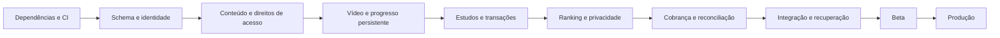

# Cronograma de conclusão do SaaS

**Base:** auditoria de `b640716`, em 13/09/2026. **Início de referência:** 14/09/2026.  
**Entrega comercial planejada:** **29/01/2027**. **Janela de contingência:** até **26/02/2027**.  
Plano de trabalho, não execução agendada: não foram criadas automações, contratos, contas pagas ou deploys.

## 1. Premissas adotadas

Para planejar sem depender de perguntas, considero um **SaaS B2C de uma única escola**, em português, inicialmente para até 50 alunos ativos, com cursos pagos, simulados, flashcards, plano de estudos, foco, perfil, ranking e administração. Web responsiva; sem white-label, organizações independentes, aplicativo nativo, IA ou marketplace de professores na versão inicial.

Capacidade de referência: **um desenvolvedor sênior com 32 horas produtivas por semana**, incluindo implementação, testes, revisão e documentação. Previsão-base de **576 horas técnicas**, distribuídas em 18 semanas produtivas e duas semanas de folga de calendário no fim do ano. Uma revisão independente de segurança/QA de 16–32 horas deve ocorrer antes do público, além desse esforço. Não são pessoas já contratadas nem subagentes em execução.

Produção/revisão pedagógica dos cursos, titularidade do conteúdo, domínio, habilitação do meio de pagamento e aprovação dos textos de negócio são dependências externas. O plano prevê prepará-las cedo; não presume que já estejam concluídas. As datas são estimativas de capacidade, não promessa de término independente desses fatores.

**Faixa técnica esperada:** 480–704 horas, usando 576 como base e 128 adicionais como contingência técnica. As duas semanas de fim de ano absorvem disponibilidade reduzida e não contam como capacidade técnica prevista. Ao terminar o primeiro fluxo real de curso/aula, recalibrar usando o tempo observado por domínio.

## 2. Caminho crítico

Infra de teste, segurança, observabilidade básica e testes negativos acompanham cada fase; não ficam para a última semana. As interfaces de pagamento e direitos de acesso são definidas na fundação, mesmo que o checkout completo entre mais tarde.

## 3. Calendário-base

| Fase | Semanas / datas | Esforço | Entrega verificável | Critério para avançar |
|---|---|---:|---|---|
| 1. Fundação e segurança imediata | S1–2 · 14–25/09/2026 | 64 h | Dependências corrigidas, ambiente reproduzível, CI com Postgres efêmero, schema reconciliado e fronteira transacional | Pipeline verde; production rejeita mock/seed; decisões de dados registradas; banco de teste restaurável |
| 2. Identidade e persistência base | S3–4 · 28/09–09/10 | 64 h | Usuários/perfis reais, cadastro/convite, verificação/reset de senha, revogação, limites e auditoria | Usuário desativado perde acesso imediatamente; callback limitado; reset uso único; nenhum dado privado entre contas |
| 3. Conteúdo e mídia | S5–6 · 12–23/10 | 64 h | Cursos/módulos/aulas/materiais, admin, matrícula com direito validado, streaming privado e anotações | Admin publica uma aula real; aluno autorizado assiste e retoma; não autorizado/rascunho não acessa mídia |
| 4. Progresso e simulados | S7–8 · 26/10–06/11 | 64 h | Heartbeat no Postgres, outbox, prova versionada, respostas salvas, correção transacional | Concorrência e falha de banco não duplicam pontos nem deixam prova finalizada sem respostas; refresh recupera progresso |
| 5. Estudos e produtividade | S9–10 · 09–20/11 | 64 h | Plano/missão, foco, flashcards, favoritos, Brainstorm e conversões persistentes | Jornada completa sobrevive a restart; apenas uma revisão/ciclo pontua sob concorrência; missão inicia/retoma/finaliza |
| 6. Gamificação, ranking e experiência | S11–12 · 23/11–04/12 | 64 h | Métricas reais, regras versionadas, metas/timezone, conquistas admin, privacidade, trilha, busca e sino | Zero participante fictício em produção; flags aplicadas em todos os DTOs; config altera apenas comportamento futuro conforme regra |
| 7. Comercial e operação | S13–14 · 07–18/12 | 64 h | Plano/checkout, webhooks, acesso por assinatura, cancelamento/reembolso, e-mails, políticas operacionais e suporte | Pagamento repetido/fora de ordem não duplica acesso; cancelamento e expiração obedecem política; reconciliação corrige divergências |
| Folga de calendário | S15–16 · 21/12–01/01/2027 | 0 h planejadas | Reserva para disponibilidade de fim de ano e dependências externas | Nenhum lançamento obrigatório em feriados; se usada para recuperar atraso, registrar consumo |
| 8. Homologação completa | S17–18 · 04–15/01/2027 | 64 h | E2E, mobile/acessibilidade, carga, restore, rollback, alertas e revisão de segurança | Todos os gates abaixo aprovados; ausência de crítico/alto aplicável sem tratamento; revisão independente concluída |
| 9. Beta fechado | S19 · 18–22/01 | 32 h | Grupo limitado, conteúdo real, atendimento e monitoramento diário | Cinco dias úteis de observação; fluxos completos validados; nenhuma perda de dados/cobrança incorreta; bugs impeditivos encerrados |
| 10. Lançamento e entrega | S20 · 25–29/01 | 32 h | Ativação gradual, smoke pós-deploy, manual operacional e transferência de conhecimento | Compra → conta → aula → progresso → cancelamento demonstrados; recuperação testada; custos medidos |
| Reserva técnica | S21–24 · 01–26/02 | até 128 h | Correções de migração, integração, segurança ou indisponibilidade de fornecedor | Usada por evidência de atraso, sem retirar critérios de segurança/qualidade |

**Marcos:** base segura em 25/09; identidade real em 09/10; curso real em staging em 23/10; módulos de estudo integrados em 04/12; comercial completo em staging em 18/12; beta em 18/01; lançamento planejado em 29/01.

Datas intermediárias representam o plano, não funcionalidades já executadas. Um atraso na identidade, persistência ou pagamento desloca os marcos dependentes. A equipe pode antecipar uma prévia interna com dados sintéticos, mas não chamar isso de SaaS comercial concluído.

## 4. Backlog executável por fase

Cada item termina com PR pequeno, revisão, evidência de teste e atualização deste documento. IDs S/F referenciam o [relatório](RELATORIO.md).

### Fase 1 — Fundação

- [ ] **B01 · P0 · S01:** atualizar dependências/runtime com lockfile e verificar advisories da árvore usada. Aceite: lint/types/test/build e triagem de cada alerta crítico/alto, sem downgrade automático de Prisma.
- [ ] **B02 · P0 · S04/S10:** bloquear mock e seed em produção, adicionar `.env.example` seguro, fixar Node/gerenciador, scripts de migrate/status/bootstrap. Aceite: configuração inválida falha antes de atender requisições.
- [ ] **B03 · P0 · F09:** mapear todos os contratos ao schema e criar migration incremental. Incluir slug/matéria de módulo, privacidade, sessões, notas, config, snapshot de prova, favoritos e inbox/outbox. Aceite: banco vazio e banco anterior migram sem perda.
- [ ] **B04 · P0 · S07/S08:** definir transação compartilhada entre repositórios e estratégia de eventos. Aceite: erro injetado desfaz gravações relacionadas ou deixa evento durável recuperável.
- [ ] **B05 · P0:** CI com Postgres descartável e testes de contrato dos repositórios desde o início. Aceite: PR defeituoso não passa; build não usa segredo real nem banco de produção.
- [ ] **B06 · P1 · F07:** definir `AccessPolicy`/entitlements, plano inicial e contrato de webhook sem integrar fornecedor ainda. Aceite: serviço de aula/matrícula depende de política server-side, com fake de teste explícito.

### Fase 2 — Identidade

- [ ] **B07 · P0 · S02/S09:** implementar users/profiles, normalização de e-mail e checagem de ativo/exclusão. Aceite: cookie antigo de conta bloqueada não autoriza; privacidade permanece após restart.
- [ ] **B08 · P0 · S03:** limite atômico por conta/origem no provider, com TTL e auditoria. Aceite: o smoke de callback passa a bloquear tentativas excedentes; erro de infraestrutura não abre a proteção.
- [ ] **B09 · P1 · F06:** cadastro/convite, senha forte, verificação de e-mail e recuperação por token hasheado, expirável e de uso único. Aceite: reuse, brute force e enumeração são recusados sem vazar conta.
- [ ] **B10 · P1:** MFA administrativo de aplicação e recuperação segura. Aceite: conta privilegiada não acessa painel sem completar segundo fator; códigos de recuperação não reutilizáveis.
- [ ] **B11 · P0 · S08/S10:** auditoria persistente, timestamp/correlação e bootstrap do primeiro admin sem senha no Git. Aceite: não é possível remover o último admin ativo em duas requisições concorrentes.

### Fase 3 — Conteúdo

- [ ] **B12 · P1 · F00/S06:** concursos, matérias, assuntos, professores, cursos, módulos, aulas e matrículas Prisma. Aceite: criação, edição, ordenação, publicação e exclusão lógica respeitam todas as FKs e a visão aluno/admin.
- [ ] **B13 · P1 · F01/F08:** integrar streaming, processamento e autorização de reprodução. Aceite: vídeo real em desktop/mobile, retomada, token expirado rejeitado e URL não gerada para não matriculado.
- [ ] **B14 · P1 · F08:** upload privado de PDFs/materiais e imagens com limites, validação de tipo/conteúdo e limpeza. Aceite: arquivo impróprio bloqueado; material de outro curso não acessível por ID ou URL antiga.
- [ ] **B15 · P1 · F02:** notas persistentes com autosave/versionamento. Aceite: fechar e reabrir recupera o texto; conflito de duas abas não apaga silenciosamente conteúdo.
- [ ] **B16 · P1:** verificar cadeias de pré-requisitos e leitura de publicado por toda a árvore. Aceite: ciclo/self-reference recusado e arquivar curso bloqueia aulas mesmo por link direto.

### Fase 4 — Progresso e provas

- [ ] **B17 · P0 · S07/S08:** sessão/atividade e conclusão em transação; progresso + outbox. Aceite: 20 requisições concorrentes na transição geram uma conclusão e uma recompensa; crash/retry não perde bônus.
- [ ] **B18 · P1:** prova e alternativas com snapshot/versão; respostas parciais persistidas. Aceite: alterar questão no admin não muda tentativa em andamento ou resultado histórico; reload recupera respostas.
- [ ] **B19 · P0 · S07:** finalizar/expirar prova em transação com CAS e dados de correção. Aceite: falha após cada etapa é recuperável; usuário não vê gabarito antes do estado permitido.
- [ ] **B20 · P1:** questões, simulados, tentativas, erros e favoritos Prisma. Aceite: todas as consultas filtram dono/visibilidade; testes contra banco cobrem filtros, paginação e prazo.

### Fase 5 — Estudos

- [ ] **B21 · P1 · F12:** plano/itens/missão persistentes com conclusão e retomada. Aceite: itens apontam a conteúdo existente e execução avança de bloco sem confiar em tempo/pontos do cliente.
- [ ] **B22 · P0 · S08:** foco persistente e lock por usuário no banco. Aceite: dois starts/finalizações não duplicam ciclo/pontos; uma interrupção pode ser retomada conforme política.
- [ ] **B23 · P1 · F10:** decks/cards/revisões/favoritos com estado de revisão único. Aceite: concorrência e origem repetida não criam duplicatas; dono correto em todas as operações.
- [ ] **B24 · P1 · F10:** Brainstorm em transação e conversão para entidade real. Aceite: erro no meio não deixa cartão marcado como convertido sem flashcard/tarefa; mover entre colunas preserva ordem.

### Fase 6 — Consistência e experiência

- [ ] **B25 · P1 · F03/F05:** regras de negócio e conquistas persistentes e versionadas. Aceite: edição admin tem efeito definido e auditado; histórico não muda retroativamente sem recálculo explícito.
- [ ] **B26 · P1 · F04/F13:** candidatos/métricas reais, timezone e snapshots do ranking. Aceite: nenhuma dependência de dataset fictício, métricas limitadas ao período, exclusão de candidatos removidos, evolução baseada em execuções reais.
- [ ] **B27 · P1 · S05:** privacidade uniforme de perfil/ranking. Aceite: teste com dois alunos verifica ausência dos campos protegidos no JSON/RSC, não só visualmente.
- [ ] **B28 · P1 · F11:** trilha, busca e notificações conectadas. Aceite: busca respeita acesso, paginação e publicação; sino reflete mensagens e leitura; links levam ao fluxo esperado.
- [ ] **B29 · P1:** metas/sequência/diagnóstico e tempo de foco integrados. Aceite: dia civil e virada de meia-noite testados; metas e desempenho refletem os eventos do aluno real.

### Fase 7 — SaaS comercial

- [ ] **B30 · P1 · F07:** checkout de um plano inicial e identidade do cliente no gateway. Aceite: sandbox cobre compra aprovada, pendente e recusada sem conceder acesso indevido.
- [ ] **B31 · P0 comercial:** inbox de webhooks com assinatura, replay, ordenação e idempotência. Aceite: evento duplicado/atrasado/desconhecido não altera direitos incorretamente; job reconcilia com o gateway.
- [ ] **B32 · P1:** ciclo de assinatura, cancelamento, inadimplência, reembolso e direitos por curso. Aceite: UI e backend aplicam o mesmo prazo; matrícula livre não contorna cobrança.
- [ ] **B33 · P1:** e-mails de acesso/cobrança e suporte, tratamento de bounce/falha/retry. Aceite: entrega autenticada no domínio e links corretos por ambiente.
- [ ] **B34 · P1:** textos de negócio, canal de privacidade/suporte, exportação/exclusão e retenção. Aceite: operação demonstrada sem apagar registros que precisam ser retidos; responsável de negócio valida os textos.

### Fase 8 — Homologação

- [ ] **B35 · P1:** E2E dos fluxos comerciais e de estudo, autorização negativa com dois usuários e roles distintos, navegador mobile e teclado. Aceite: suite automatizada repetível; revisão manual sem falhas impeditivas.
- [ ] **B36 · P1:** carga, consultas, índices, cache e payloads. Aceite inicial proposto: 50 sessões simultâneas de estudo, 30 minutos de carga, erro <1%, p95 de heartbeat <500 ms e ausência de crescimento contínuo do pool; medir em staging na região escolhida.
- [ ] **B37 · P1:** backups externos, restore de banco/arquivos/segredos e rollback de deploy. Aceite proposto: RPO de até 24 h e RTO de até 4 h para o piloto, comprovados por ensaio. Eventos financeiros devem ser reconciliáveis com o gateway após restauração; requisitos menores de perda exigem PITR/custo adicional.
- [ ] **B38 · P1:** health check, logs, erros/alertas, orçamento e runbooks. Aceite: falha controlada dispara alerta útil e tem procedimento de resposta; nenhum token/PII desnecessário nos logs.
- [ ] **B39 · P0/P1:** revisão independente de segurança, varredura final e revalidação dos S01–S10. Aceite: nenhuma falha crítica/alta aplicável aberta e cenários de caracterização convertidos em regressões defensivas.

### Fases 9–10 — Entrega

- [ ] **B40 · P1:** beta com coorte pequena e métricas operacionais diárias. Aceite: jornada completa, disponibilidade e suporte demonstrados durante cinco dias úteis; bugs impeditivos corrigidos.
- [ ] **B41 · P1:** lançamento gradual e smoke autenticado pós-deploy. Aceite: transação comercial controlada e reconciliação confirmadas, sem migração destrutiva no build.
- [ ] **B42 · P1:** documentação de instalação, deploy, reversão, conteúdo, suporte e cobrança; catálogo mínimo real revisado. Aceite: outra pessoa consegue operar e restaurar seguindo o manual.

## 5. Distribuição dos 37 repositórios existentes

| Grupo | Repositórios | Fase principal |
|---|---|---|
| Identidade | user, profile | 2 |
| Catálogo/acesso | contest, subject, topic, teacher, course, module, lesson, enrollment | 3 |
| Progresso | lesson-progress, study-session | 4 |
| Simulados | question, question-option, mock-exam, mock-exam-attempt, question-attempt, question-favorite | 4 |
| Planejamento | study-plan, study-plan-item, study-mission | 5 |
| Produtividade | focus-session, flashcard-deck, flashcard, flashcard-review, brainstorm-board, brainstorm-column, brainstorm-card | 5 |
| Metas | daily-goal, weekly-goal, user-streak | 6 |
| Gamificação | gamification-event, point-transaction, user-achievement, achievement, ranking-score | Fundação transacional em 1/4; conclusão em 6 |
| Comunicação | notification | 6 |

Total: 37. Auditoria, assinatura, pagamento, anotação, configuração, material, tokens e novos agregados exigem contratos adicionais; não estão escondidos nessa contagem.

## 6. Gates de liberação

**G1 — Base:** versões e lockfile controlados, CI reproduzível, migrações testadas, produção sem mock/defaults.  
**G2 — Identidade:** sessão revogável, callback limitado, MFA admin, recuperação, isolamento e privacidade.  
**G3 — Produto:** todas as funcionalidades habilitadas usam Postgres, mídia real e regras consistentes. Não há “salvo” que se perca em restart.  
**G4 — Comercial:** compra, pendência, recusa, renovação, cancelamento, reembolso e replay de webhook testados.  
**G5 — Operação:** backup/restore, alertas, rollback, carga, suporte, domínio/TLS e procedimentos de dados pessoais.  
**G6 — Público:** beta observado, revisão final e responsável operacional apto a agir.

Cada gate exige evidência anexada (teste, log sanitizado, configuração revisada ou ensaio). Contas ativas em provedores não substituem G3; build verde não substitui G4/G5.

## 7. Dependências externas e prevenção de atraso

| Dependência | Preparar até | Efeito se faltar | Trabalho que pode continuar |
|---|---|---|---|
| Contas de hosting, banco e orçamento | S2 | Sem staging real | Implementação/testes locais e CI efêmero |
| Domínio e identidade de envio | S3 | Sem validação real de e-mail | Templates e integração em sandbox |
| Catálogo mínimo com direitos de uso | S5 | Sem validação de mídia e experiência | Conteúdo sintético autorizado para QA |
| Gateway, titularidade e validação da conta | Iniciar S2; pronto S12 | Bloqueia compra comercial | Sandbox, state machine e replay de eventos |
| Textos comerciais/privacidade e suporte | Iniciar S2; pronto S14 | Bloqueia lançamento com usuários reais | Implementar fluxos técnicos e registro de versões |
| Revisor independente | Reservar S12; executar S18 | Gate de segurança sem verificação externa | E2E, correções e preparação do beta |

## 8. Melhorias após a entrega

Sem ocupar a capacidade do caminho crítico: ciclos múltiplos de Pomodoro, certificados, relatórios avançados, importação em massa com validação, pesquisas melhores e otimização baseada em métricas. White-label/multitenancy, aplicativos nativos, IA, afiliados e marketplace precisam de novo dimensionamento.

Para reduzir prazo, reduzir explicitamente o produto público (por exemplo, cursos + simulados e assinatura, ocultando módulos secundários). Não reduzir autenticação, integridade, cobrança, privacidade ou recuperação. Este calendário cobre os módulos atuais, e não aplica esse corte silenciosamente.
