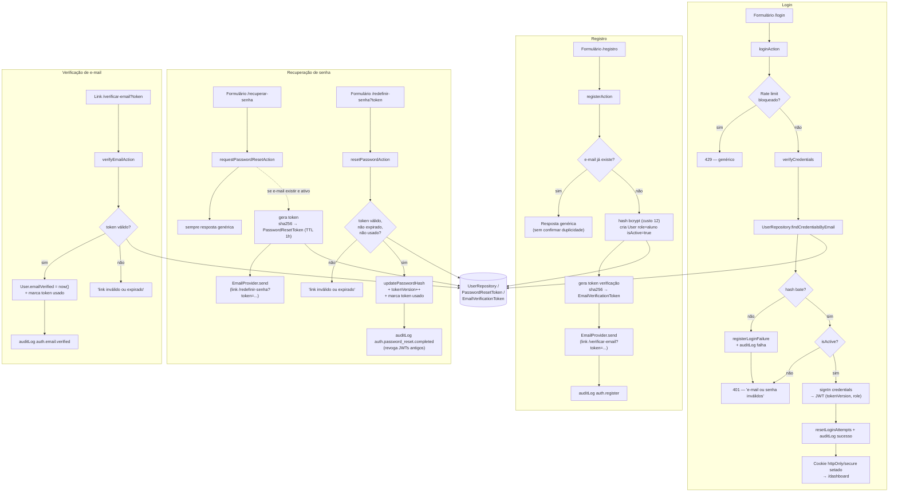

# Plano de Autenticação — Produção (Operação Aprovação)

> Produzido pelo subagente `backend`. Complementa [`CURRENT_STATE.md`](./CURRENT_STATE.md)
> (bloqueador #1 verificado no código), [`TARGET_ARCHITECTURE.md`](./TARGET_ARCHITECTURE.md)
> (decisão de manter Auth.js v5) e [`docs/SECURITY.md`](../SECURITY.md) (§2, §4, §8 — checklist
> de handoff). Este documento **detalha a implementação**: o que muda, arquivos afetados,
> modelos novos e o teste de regressão do bloqueador. Não altera código — é o plano para a
> Fase 8 (bloqueador de senha) e Fase 15 (registro/recuperação) do
> [`ROADMAP_SKELETON.md`](./ROADMAP_SKELETON.md).

## 0. Decisão de base (mantida)

**Auth.js v5 (NextAuth) Credentials Provider + sessão JWT.** Já justificado em
`TARGET_ARCHITECTURE.md` §3 — não repetir aqui. Este plano assume essa base e endurece/completa
o que falta: mover a senha para o `UserRepository`, e adicionar os fluxos que hoje não existem
(registro, recuperação de senha, verificação de e-mail).

## 1. Bloqueador #1 — mover a senha do mock para o `UserRepository`

### 1.1 Estado verificado hoje

`src/server/auth/credentials-service.ts` importa `mockCredentials`/`DEV_PASSWORD_HASH` de
`@/mocks` (→ `src/mocks/data/credentials.ts`) **de forma incondicional** — o import não respeita
`DATA_SOURCE`. Isso significa: ligar `DATA_SOURCE=prisma` faz (a) usuários reais nunca logarem
(hash real nunca é lido) e (b) qualquer e-mail existente também no mock virar backdoor com
`senha123`. Detalhado em `docs/SECURITY.md` §2.

### 1.2 Correção

1. **Novo método na interface `UserRepository`** (`src/server/repositories/contracts/user-repository.ts`):
   ```ts
   export interface UserCredentials {
     userId: string;
     passwordHash: string;
   }

   export interface UserRepository {
     // ...métodos existentes
     findCredentialsByEmail(email: string): Promise<UserCredentials | null>;
   }
   ```
2. **`MockUserRepository`** (`src/server/repositories/mock/user-repository.ts`) implementa lendo
   de `@/mocks/data/credentials` — **só a implementação mock importa o mock**, nunca o service de
   auth.
3. **`PrismaUserRepository`** (`src/server/repositories/prisma/user-repository.ts`) implementa
   lendo `user.passwordHash` (campo já existe no schema — `prisma/schema.prisma:214`, não precisa
   migration nova para este campo específico).
4. **`credentials-service.ts` reescrito** para nunca importar `@/mocks` diretamente:
   ```ts
   const passwordHash = (await getRepositories().users.findCredentialsByEmail(normalizedEmail))?.passwordHash;
   ```
   A defesa de timing (comparar contra um hash "dummy" quando `passwordHash` é `null`) deixa de
   depender de `DEV_PASSWORD_HASH` do mock — vira uma constante interna do módulo de auth (ex.:
   `src/server/auth/constants.ts`, hash bcrypt fixo gerado uma vez, nunca correspondente a uma
   senha real), usada igualmente em ambas as implementações de repositório.
5. **Timing-defense preservada nas duas implementações**: tanto `MockUserRepository` quanto
   `PrismaUserRepository` devem devolver `null` de forma indistinguível (nenhuma delas deve, por
   si, introduzir uma diferença de tempo detectável); o `bcrypt.compare` contra o hash dummy
   continua vivendo em `credentials-service.ts` (camada única, já é onde a defesa está hoje).

### 1.3 Teste de regressão sugerido (bloqueador)

Objetivo: **provar que a senha de dev do mock (`senha123`) nunca autentica quando a fonte de
dados não é o mock** — o cenário exato do backdoor.

```ts
// tests/unit/credentials-service-prisma-regression.test.ts
import { describe, expect, it, vi } from "vitest";
import { DEV_MOCK_PASSWORD } from "@/mocks";

// Repositório fake que simula PrismaUserRepository com um hash REAL diferente do mock.
const REAL_PASSWORD_HASH = await bcrypt.hash("senha-real-do-usuario", 12);

vi.mock("@/server/repositories", () => ({
  getRepositories: () => ({
    users: {
      findCredentialsByEmail: async (email: string) =>
        email === "usuario.real@example.com"
          ? { userId: "real-user-1", passwordHash: REAL_PASSWORD_HASH }
          : null,
      findByEmail: async () => ({ id: "real-user-1", isActive: true, role: "aluno", /* ... */ }),
    },
  }),
}));

describe("regressão — bloqueador #1 (senha mock não pode autenticar fora do DATA_SOURCE=mock)", () => {
  it("rejeita a senha de dev mock (senha123) mesmo que o e-mail exista no repositório real", async () => {
    const session = await verifyCredentials("usuario.real@example.com", DEV_MOCK_PASSWORD);
    expect(session).toBeNull();
  });

  it("aceita a senha real do usuário quando o hash bate", async () => {
    const session = await verifyCredentials("usuario.real@example.com", "senha-real-do-usuario");
    expect(session).not.toBeNull();
  });
});
```

Critério de aceite: este teste **deve falhar no código atual** (a senha mock autentica hoje
porque o import é incondicional) e **deve passar após a correção da seção 1.2**. Rodar como
regressão obrigatória no CI antes de qualquer ambiente ligar `DATA_SOURCE=prisma` (ver
`CI_CD.md`). Manter também os testes existentes de `tests/unit/credentials-service.test.ts`
(cenário `DATA_SOURCE=mock`, continuam válidos sem alteração de comportamento).

## 2. Modelos Prisma novos necessários (coordenar com `database`)

Não existem hoje modelos para tokens de reset/verificação. Propostos (a aplicar pelo agente
`database` na mesma migration que ligar o restante da Fase 15):

```prisma
model PasswordResetToken {
  id        String    @id @default(cuid())
  userId    String
  tokenHash String    @unique // SHA-256 do token enviado por e-mail — nunca o token em claro.
  expiresAt DateTime
  usedAt    DateTime?
  createdAt DateTime  @default(now())

  user User @relation(fields: [userId], references: [id], onDelete: Cascade)

  @@index([userId])
}

model EmailVerificationToken {
  id        String    @id @default(cuid())
  userId    String
  tokenHash String    @unique
  expiresAt DateTime
  usedAt    DateTime?
  createdAt DateTime  @default(now())

  user User @relation(fields: [userId], references: [id], onDelete: Cascade)

  @@index([userId])
}
```

E em `User` (`prisma/schema.prisma:210`): adicionar `tokenVersion Int @default(0)` — usado na
revogação de sessão (seção 5.3). `emailVerified DateTime?` **já existe** no schema (linha 216),
hoje não usado por nenhum fluxo — passa a ser setado pela verificação de e-mail.

**Por que hash do token, nunca token em claro:** mesmo princípio de nunca guardar segredo em
claro (senha); se o banco vazar, os links de reset/verificação já usados ou pendentes não viram
credencial válida. O e-mail carrega o token em claro na URL; o servidor só guarda
`sha256(token)` e compara.

## 3. Fluxos — o que muda e o que é novo

### 3.1 Login (existente — mantido, só a fonte da senha muda)

Sem mudança de UX. `loginAction` (`src/server/actions/auth.ts`) continua validando com
`loginSchema`, chamando `verifyCredentials`, aplicando rate limit e auditoria — só a
implementação interna de `verifyCredentials` muda (seção 1).

### 3.2 Registro (`(auth)/registro`) — novo

1. Contrato novo `registerSchema` em `src/contracts/auth.ts`: `name`, `email`, `password`,
   `passwordConfirmation` (validação de igualdade), política de senha mínima (ex.: 8+ caracteres,
   pelo menos 1 número — valor exato configurável em `PASSWORD_POLICY`, `src/config/business.ts`).
2. Novo service `src/server/services/auth/register-service.ts`:
   - Normaliza e-mail; verifica duplicidade via `findByEmail` — resposta **sempre genérica**
     ("se o e-mail não estiver em uso, você poderá concluir o cadastro") para não confirmar
     por enumeração se um e-mail já existe (mesmo princípio anti-enumeração do login).
   - Hash da senha com bcrypt (mesmo custo usado no restante do sistema — ver seção 4).
   - Cria o usuário com `role: "aluno"` **fixo no servidor** (nunca aceitar `role` do payload de
     registro — mesma regra dura do login) e `isActive: true`, `emailVerified: null`.
   - Gera token de verificação de e-mail (seção 3.4) e dispara e-mail (via `EmailProvider`,
     dependência da Fase 14 do roadmap — ver nota na seção 6).
   - Rate limit de registro por IP (`REGISTER_RATE_LIMIT`, novo em `business.ts`) — mesma
     interface de `rate-limit.ts`, escopo próprio (não reaproveitar o contador de login).
3. Nova Server Action `registerAction` (`src/server/actions/auth.ts`) — audita
   `auth.register` (sucesso/falha), nunca loga a senha.
4. Novas páginas: `src/app/(auth)/registro/page.tsx` + `registro-form.tsx` (mesmo padrão de
   `login-form.tsx`: React Hook Form + Zod, `useTransition`, mensagens genéricas).

### 3.3 Recuperação de senha (`(auth)/recuperar-senha`, `(auth)/redefinir-senha`) — novo

Duas etapas:

1. **Solicitar** (`forgotPasswordSchema`: só `email`) → `password-reset-service.ts`:
   - Sempre responde com a mesma mensagem genérica, exista ou não o e-mail (anti-enumeração).
   - Se existir usuário ativo, gera token aleatório (ex.: 32 bytes `crypto.randomBytes`),
     grava `sha256(token)` em `PasswordResetToken` com `expiresAt = now + 1h` (`PASSWORD_RESET.tokenTtlMs`,
     novo em `business.ts`), envia e-mail com link `/redefinir-senha?token=<token-em-claro>`.
   - Rate limit por e-mail/IP (reaproveita o padrão de `rate-limit.ts`, escopo próprio) — evita
     abuso de disparo de e-mail.
   - Auditoria: `auth.password_reset.requested` (nunca registra o token).
2. **Redefinir** (`resetPasswordSchema`: `token`, `password`, `passwordConfirmation`) →
   - Busca `PasswordResetToken` pelo hash do token recebido; rejeita se inexistente, expirado ou
     `usedAt` já preenchido (uso único) — mensagem genérica de "link inválido ou expirado" em
     todos os casos (não diferenciar "expirado" de "já usado" para não vazar estado).
   - Atualiza `passwordHash` do usuário (novo método `UserRepository.updatePasswordHash`), marca
     o token como usado (`usedAt = now`), **incrementa `tokenVersion`** do usuário (revoga
     sessões JWT ativas — seção 5.3), invalida quaisquer outros tokens de reset pendentes do
     mesmo usuário.
   - Auditoria: `auth.password_reset.completed`.

### 3.4 Verificação de e-mail (`(auth)/verificar-email`) — novo

- Token gerado no registro (e reenviável via ação `resendVerificationEmailAction`, com rate
  limit próprio para não virar vetor de spam de e-mail).
- `EmailVerificationToken` com TTL maior que o de reset (ex.: 24h — `EMAIL_VERIFICATION.tokenTtlMs`).
- Ao acessar `/verificar-email?token=...`: valida hash/expiração/uso único (mesmo padrão do
  reset), seta `User.emailVerified = now()`, marca token usado. Auditoria: `auth.email.verified`.
- **Decisão de produto a confirmar com `architect`/negócio:** e-mail não verificado bloqueia
  login ou só emite aviso/funcionalidade limitada? Este plano assume **não bloqueia** (login
  continua liberado; verificação é best-effort) até decisão explícita em contrário — mudar isso
  é uma regra de negócio, não um detalhe técnico.

### 3.5 Logout (existente — sem mudança)

`logoutAction` (`signOut`) já funciona corretamente sobre o cookie JWT; nenhuma alteração.

## 4. Hash de senha

Manter **bcryptjs** (já é dependência, já usado, evita depender de binding nativo — `argon2`
teria compilação nativa problemática em builds serverless da Vercel). Ação recomendada: subir o
custo de `10` (usado hoje no mock, `credentials.ts:16`) para **`12` rounds** no hashing de
produção (registro e redefinição de senha) — mantém tempo de verificação abaixo de ~250ms em
runtime Node da Vercel, ainda um custo significativo para força bruta offline. Documentar o
valor em `src/config/business.ts` (`PASSWORD_POLICY.bcryptCost = 12`) em vez de espalhar o
literal pelo código.

## 5. Sessão, cookies e revogação

### 5.1 Cookies seguros

Auth.js v5 já aplica por padrão em produção (`NODE_ENV=production` + `trustHost`/HTTPS):
`httpOnly`, `secure`, `sameSite: lax` no cookie `authjs.session-token` (ou
`__Secure-authjs.session-token` sob HTTPS). Nenhuma configuração manual adicional necessária —
confirmar em `next.config.ts`/deploy que a app roda sempre sob HTTPS (Vercel garante isso por
padrão em produção).

### 5.2 Expiração

Já configurada (`authEdgeConfig`, `config.edge.ts:26`): `maxAge: 7 dias`, `updateAge: 1 dia`.
Mantido — nenhuma mudança.

### 5.3 Revogação de sessão — lacuna encontrada e correção proposta

**Achado:** sessão JWT (sem tabela de sessão) não revalida `isActive`/`role` a cada requisição —
apenas no momento do login (`verifyCredentials`). Hoje, desativar um usuário (`setActive(false)`,
já existe no admin) **não invalida** um JWT já emitido: ele continua válido até expirar
naturalmente (até 7 dias) ou até o próximo `updateAge` (1 dia), porque o callback `jwt` só
popula dados a partir de `user` no momento do `signIn` — nas chamadas seguintes apenas repassa o
token existente.

**Correção proposta:** usar `User.tokenVersion` (seção 2) como versão de revogação:
1. No login, gravar `token.tokenVersion` no JWT junto com `userId`/`role`.
2. No callback `jwt` (`config.edge.ts`), quando `trigger === "update"` (Auth.js dispara
   periodicamente por volta de `updateAge`) **ou** a cada N minutos via checagem de timestamp
   embutido no próprio token, buscar o usuário atual (`getRepositories().users.findById`) e
   comparar `tokenVersion`/`isActive`/`role`: se o usuário foi desativado, teve a senha trocada
   (que já incrementa `tokenVersion`, seção 3.3) ou teve o papel alterado, **invalidar o token**
   (Auth.js permite lançar erro no callback `jwt`, forçando novo login).
3. Isso é uma leitura de banco **não a cada request**, só no ciclo de refresh do `updateAge` —
   troca latência por não fazer round-trip ao banco em toda requisição, aceitando uma janela de
   até `updateAge` (1 dia) para revogação "suave"; ações **sensíveis** (troca de senha, admin
   desativando conta) devem, adicionalmente, poder forçar um logout imediato client-side (ex.:
   `signOut` disparado pela própria action que troca a senha, quando é o próprio usuário
   trocando).
4. Alternativa mais forte (não recomendada agora): trocar para sessão em banco
   (`session: { strategy: "database" }`) permitiria revogação imediata e exata, mas exige tabela
   de sessão e um round-trip ao banco em toda requisição autenticada — custo maior, contraria a
   recomendação de manter Auth.js leve com JWT (`TARGET_ARCHITECTURE.md` §3). Revisitar só se o
   produto exigir revogação instantânea garantida (ex.: requisito de compliance).

## 6. Rate limiting, RBAC, proteção de rotas, autorização (sem mudança estrutural)

- **Rate limit / lockout de login:** já implementado (`rate-limit.ts`), store em `globalThis` —
  migração para store distribuído (Upstash/KV) é a Fase 10 do roadmap, **mesma interface
  pública** preservada (`checkLoginRateLimit`/`registerLoginFailure`/`resetLoginAttempts`); os
  novos fluxos (registro, reset, reenvio de verificação) devem usar a mesma função genérica com
  chaves de escopo próprias (ex.: `register:<ip>`, `pwreset:<email>`) para não competir pelo
  mesmo contador do login.
- **Mitigação de tentativas abusivas — Cloudflare Turnstile:** adicionar o widget Turnstile no
  formulário de login (e opcionalmente registro) — funciona independente do provedor de
  hospedagem (Vercel), só requer `TURNSTILE_SITE_KEY` (público, embutido no client) e
  `TURNSTILE_SECRET_KEY` (secreto, usado no servidor para validar o token via
  `https://challenges.cloudflare.com/turnstile/v0/siteverify`). Estratégia recomendada:
  acionar o desafio **de forma adaptativa** — sempre visível a partir da 2ª falha de login
  registrada pelo rate limit (não a cada tentativa, para não prejudicar UX de quem erra uma vez);
  a verificação do token Turnstile acontece no servidor **antes** do `bcrypt.compare` (mesma
  lógica de "barrar cedo" já usada pelo rate limit).
- **RBAC (`aluno/professor/moderador/admin`):** matriz já existe
  (`src/server/services/admin/roles.ts`) — sem mudança. Novos usuários registrados nascem sempre
  `aluno`; alteração de papel continua exclusiva de `admin` via `updateRole`.
- **Proteção de rotas:** `middleware.ts` precisa incluir as novas rotas públicas:
  ```ts
  const PUBLIC_PATHS = ["/login", "/registro", "/recuperar-senha", "/redefinir-senha", "/verificar-email"];
  ```
  Autorização real continua 100% server-side (`requireUser`/`requireRole` em
  `src/server/authorization/index.ts`) — middleware permanece "só UX".
- **Auditoria de login:** `auditLog()` já registra `auth.login`/`auth.login.blocked`; passam a
  existir também `auth.register`, `auth.password_reset.requested/completed`,
  `auth.email.verify_requested/verified`. A persistência de `auditLog()` em banco (hoje só
  memória) é a Fase 9 do roadmap — fora do escopo deste plano, mas os novos eventos já devem
  seguir o mesmo formato (`AuditEntry`) para serem persistidos sem retrabalho quando essa fase
  chegar.

## 7. Dependência externa: `EmailProvider`

Recuperação de senha e verificação de e-mail **dependem de envio real de e-mail**, que hoje não
existe no projeto (`CURRENT_STATE.md` bloqueador #8; roadmap Fase 14 antes da Fase 15). Este
plano já define a interface esperada para não bloquear o desenho:

```ts
// src/server/services/email/email-provider.ts
export interface EmailProvider {
  send(params: { to: string; subject: string; html: string; text?: string }): Promise<void>;
}
```

- Implementação `ConsoleEmailProvider` (dev/local): loga o link no console em vez de enviar —
  permite testar os fluxos de reset/verificação sem provedor real (`ENVIRONMENTS.md` §1 item 5:
  "nunca disparar e-mail real... a partir de dev/staging" para endereços de terceiros).
- Implementação real (Resend/Postmark/SES — decisão do `backend` na Fase 14) plugada atrás da
  mesma interface; nenhum service de auth conhece o provedor concreto.

## 8. Arquivos a alterar/criar (resumo)

**Alterar:**
- `src/server/repositories/contracts/user-repository.ts` — `findCredentialsByEmail`,
  `updatePasswordHash`, `createUser`, `markEmailVerified`, `incrementTokenVersion`.
- `src/server/repositories/mock/user-repository.ts` — implementações mock dos métodos acima.
- `src/server/repositories/prisma/user-repository.ts` — implementações reais.
- `src/server/auth/credentials-service.ts` — remove import direto de `@/mocks`.
- `src/server/auth/config.edge.ts` — callback `jwt` com `tokenVersion`/revalidação periódica.
- `src/server/auth/rate-limit.ts` — generalizar para escopos além de login (ou módulo irmão).
- `src/contracts/auth.ts` — `registerSchema`, `forgotPasswordSchema`, `resetPasswordSchema`,
  `verifyEmailSchema`.
- `src/server/actions/auth.ts` — `registerAction`, `requestPasswordResetAction`,
  `resetPasswordAction`, `verifyEmailAction`, `resendVerificationEmailAction`.
- `src/middleware.ts` — novas rotas públicas.
- `src/config/business.ts` — `PASSWORD_POLICY`, `PASSWORD_RESET`, `EMAIL_VERIFICATION`,
  `REGISTER_RATE_LIMIT`.
- `src/config/env.ts` — `TURNSTILE_SITE_KEY`/`TURNSTILE_SECRET_KEY` (e, quando a Fase 14
  chegar, variáveis de e-mail).
- `prisma/schema.prisma` — `PasswordResetToken`, `EmailVerificationToken`, `User.tokenVersion`
  (execução pelo agente `database`).

**Criar:**
- `src/server/services/auth/register-service.ts`, `password-reset-service.ts`,
  `email-verification-service.ts`, `token-hash.ts` (helper `sha256`).
- `src/server/services/email/email-provider.ts`, `console-email-provider.ts`.
- `src/server/repositories/contracts/password-reset-token-repository.ts` (+ mock/prisma).
- `src/server/repositories/contracts/email-verification-token-repository.ts` (+ mock/prisma).
- `src/server/auth/constants.ts` (hash dummy para timing-defense, fora de `@/mocks`).
- `src/app/(auth)/registro/page.tsx` + `registro-form.tsx`.
- `src/app/(auth)/recuperar-senha/page.tsx` + `recuperar-senha-form.tsx`.
- `src/app/(auth)/redefinir-senha/page.tsx` + `redefinir-senha-form.tsx`.
- `src/app/(auth)/verificar-email/page.tsx`.
- `tests/unit/credentials-service-prisma-regression.test.ts` (seção 1.3) + testes unitários dos
  novos services (`register-service`, `password-reset-service`, `email-verification-service`).

## 9. Diagrama — Fluxo de autenticação (login, registro, reset, verificação)


