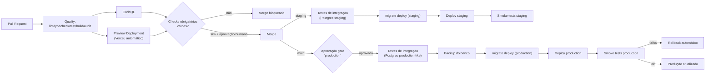

# CI/CD — Operação Aprovação

> Produzido pelo subagente `backend`. Complementa [`VERCEL_DEPLOYMENT.md`](./VERCEL_DEPLOYMENT.md)
> (estratégia de migration e ambientes na Vercel) e [`ENVIRONMENTS.md`](./ENVIRONMENTS.md)
> (checklist de promoção dev→staging→production). Define o pipeline GitHub Actions + Vercel:
> quais etapas rodam em qual gatilho e quais **bloqueiam merge** vs **bloqueiam produção**.
> Hoje **não existe workflow no repositório** (`CURRENT_STATE.md` bloqueador #11) — este
> documento é o desenho a implementar, não uma auditoria de algo já existente.

## 1. Visão geral

Duas ferramentas coexistindo, cada uma com seu papel:

- **GitHub Actions** — orquestra qualidade (lint/typecheck/test), segurança (audit/CodeQL),
  testes de integração contra Postgres, e o **job de migration** (nunca dentro do build da
  Vercel — ver `VERCEL_DEPLOYMENT.md` §6).
- **Vercel (Git integration)** — builda e publica o Next.js automaticamente a cada push (Preview
  para qualquer branch, Production para `main`) — ver `VERCEL_DEPLOYMENT.md` §1-§2. O deploy
  em si continua sendo feito pela Vercel; o GitHub Actions decide **se** ele pode ser promovido
  a receber tráfego real (gates) e executa o que a Vercel não faz (migrations, smoke tests,
  análise de segurança mais pesada).

## 2. Etapas do pipeline

| # | Etapa | O que faz | Onde roda |
|---|---|---|---|
| 1 | **Lint** | `npm run lint` (ESLint) | GitHub Actions |
| 2 | **Typecheck** | `npm run typecheck` (`tsc --noEmit`) | GitHub Actions |
| 3 | **Testes unitários** | `npm run test` (Vitest, hoje 741 testes contra mocks) | GitHub Actions |
| 4 | **Testes de integração** | Suite nova contra Postgres real (test container/branch efêmero) — exercita `PrismaXxxRepository`, algo que os 741 testes atuais **não cobrem** (`CURRENT_STATE.md` linha 72) | GitHub Actions |
| 5 | **Build** | `npm run build` (inclui `prisma generate` via `postinstall`, `VERCEL_DEPLOYMENT.md` §5) | GitHub Actions (verificação) **e** Vercel (build real do deployment) |
| 6 | **Análise de segurança** | `npm audit --audit-level=high` (dependências) + CodeQL (SAST) | GitHub Actions |
| 7 | **Preview deployment** | Automático via integração Git da Vercel a cada push de PR | Vercel |
| 8 | **Aprovação** | Revisão humana do PR (code review) + gate de ambiente (`production` protegido no GitHub, exige reviewer) antes do job de migration/deploy de produção | GitHub (branch protection + Environment protection rule) |
| 9 | **Migration** | `prisma migrate deploy` contra `DIRECT_URL` do ambiente-alvo — job isolado, nunca no build da Vercel | GitHub Actions |
| 10 | **Deploy** | Promoção do build da Vercel para o ambiente-alvo (staging ou production) | Vercel (disparado pelo push/merge, sequenciado com a etapa 9 — ver §4) |
| 11 | **Smoke tests** | Requisições contra a URL do ambiente recém-deployado (ex.: `/`, `/login` respondem 200; health check de banco) | GitHub Actions, após o deploy |
| 12 | **Rollback** | `vercel rollback` para o deployment anterior, automático se o smoke test falhar, ou manual a qualquer momento | GitHub Actions (no-fail-path) / manual via dashboard |

## 3. O que bloqueia merge vs. o que bloqueia produção

### Bloqueiam merge (obrigatórios em todo PR, via *required status checks* de branch protection)

| Etapa | Bloqueia merge em `staging` | Bloqueia merge em `main` |
|---|---|---|
| Lint | Sim | Sim |
| Typecheck | Sim | Sim |
| Testes unitários | Sim | Sim |
| Build | Sim | Sim |
| `npm audit` (alto/crítico) | Sim | Sim |
| CodeQL | Recomendado como obrigatório assim que estabilizar (sem falsos positivos recorrentes) — começar como *informativo* (comenta no PR, não bloqueia) até a equipe confiar no sinal, depois promover a obrigatório | Sim (uma vez estabilizado) |
| Testes de integração (Postgres) | **Não obrigatório em todo PR** (custo/tempo de subir Postgres a cada push) — rodar de forma completa apenas no merge para `staging`/`main` (ver §4); em PRs individuais, rodar só se o diff tocar `src/server/repositories/prisma/**` ou `prisma/schema.prisma` | mesma regra |
| Revisão de código (humana) | Sim (branch protection: mínimo 1 aprovação) | Sim (mínimo 1 aprovação, considerar 2 para `main`) |

### Bloqueiam produção (não impedem merge em `staging`, mas impedem a promoção para `main`/deploy real)

| Etapa | Bloqueia produção |
|---|---|
| Testes de integração completos contra Postgres (schema real, incluindo os `PrismaXxxRepository` implementados) | Sim — sem isso não há evidência de que o schema/migration funciona contra banco real |
| Sucesso do job de migration (`prisma migrate deploy`) no ambiente-alvo | Sim — deploy de produção não prossegue se a migration falhar |
| Backup do banco de produção **antes** da migration | Sim (gate de processo, não de ferramenta — checklist `ENVIRONMENTS.md` §4 item 5) |
| Aprovação humana do gate de ambiente `production` (GitHub Environment protection rule) | Sim — nenhum job que migre/deploye produção roda sem um reviewer designado aprovar |
| Smoke tests pós-deploy | Sim, no sentido de "aciona rollback automático em caso de falha" — não bloqueia o deploy em si (já aconteceu), mas bloqueia o deploy **permanecer** servindo tráfego |
| CodeQL / `npm audit` | Já bloquearam no merge — não repetidos como gate de produção (evita duplicar o mesmo sinal); uma nova vulnerabilidade descoberta em dependência já mergeada é tratada como item de backlog de segurança, não gate de deploy retroativo |

## 4. PR vs. merge em staging vs. merge em main

**Em todo PR** (contra `staging` ou `main`): etapas 1-3, 5-6 da tabela §2 (lint, typecheck,
testes unitários, build, `npm audit`, CodeQL) + Preview Deployment automático (etapa 7) para
revisão visual/QA manual do revisor. Rápido, sem tocar banco real, sem gate de aprovação de
ambiente.

**No merge em `staging`:** tudo do PR **mais**:
- Testes de integração completos contra Postgres (branch/instância de staging ou um banco de
  teste efêmero espelhando o schema).
- Job de migration contra a `DIRECT_URL` de **staging** (sem gate de aprovação humana adicional
  — staging não tem dados reais, `ENVIRONMENTS.md` §2, pode ser mais automático).
- Deploy do ambiente staging na Vercel.
- Smoke tests contra a URL de staging.

**No merge em `main`:** tudo do fluxo de staging **mais**:
- Gate de aprovação humana explícito (GitHub Environment `production`, reviewers designados) —
  bloqueia o início do job de migration/deploy até alguém aprovar.
- Backup do banco de produção imediatamente antes da migration.
- Job de migration contra `DIRECT_URL` de **production**.
- Deploy de produção na Vercel.
- Smoke tests contra a URL de produção — falha aciona rollback automático (`vercel rollback`).

**Sequenciamento migration → deploy (duas variantes, escolher uma):**
1. **Sequenciamento estrito (recomendado para `main`):** desabilitar o deploy automático da
   Vercel disparado só pelo push em `main` (ou aceitar que ele builda mas **não é promovido**
   automaticamente); o job de CI, após a migration ter sucesso, dispara o deploy de produção
   explicitamente (`vercel deploy --prod` via `VERCEL_TOKEN`, ou um Deploy Hook). Garante que
   nenhum código novo serve tráfego antes da migration ter sido aplicada.
2. **Sequenciamento relaxado (aceitável para `staging`, ou para `main` se toda migration for
   estritamente aditiva/expand-contract):** deixar a Vercel deployar automaticamente em paralelo
   ao job de migration do CI — só é seguro porque uma migration aditiva não quebra o código antigo
   nem o novo enquanto ambos rodam por um instante lado a lado.

## 5. Segredos necessários no GitHub Actions

Cadastrados como **GitHub Environment secrets** (escopados a `staging`/`production`, não como
Repository secrets genéricos — para que um workflow rodando no contexto `staging` não tenha
acesso aos segredos de `production`):

| Secret | Uso |
|---|---|
| `VERCEL_TOKEN` | Autentica a CLI da Vercel para disparar/promover deploys a partir do CI |
| `VERCEL_ORG_ID` / `VERCEL_PROJECT_ID` | Identificam o projeto Vercel para a CLI |
| `DATABASE_URL` (staging/production, por Environment) | Não usada pelo CI diretamente (é de runtime da app), mas útil para os testes de integração apontarem à instância correta quando aplicável |
| `DIRECT_URL` (staging/production, por Environment) | Usada pelo job de migration (`prisma migrate deploy`) |
| Segredo do CodeQL / `GITHUB_TOKEN` | Já provido automaticamente pelo GitHub Actions para upload de resultados do CodeQL |

## 6. Esqueleto ilustrativo do workflow (referência, não implementação)

```yaml
# .github/workflows/ci.yml (esqueleto — a criar por uma fase de implementação, não por este plano)
on:
  pull_request:
    branches: [staging, main]
  push:
    branches: [staging, main]

jobs:
  quality:
    runs-on: ubuntu-latest
    steps:
      - uses: actions/checkout@v4
      - run: npm ci
      - run: npm run lint
      - run: npm run typecheck
      - run: npm run test
      - run: npm run build
      - run: npm audit --audit-level=high

  codeql:
    runs-on: ubuntu-latest
    steps:
      - uses: github/codeql-action/init@v3
      - uses: github/codeql-action/analyze@v3

  integration-tests:
    if: github.event_name == 'push'   # não roda em todo PR — ver §3
    needs: quality
    runs-on: ubuntu-latest
    services:
      postgres:
        image: postgres:16
        # ...configuração de teste
    steps:
      - run: npm run db:generate
      - run: npx prisma migrate deploy
      - run: npm run test:integration

  migrate-and-deploy:
    if: github.event_name == 'push'
    needs: integration-tests
    environment: ${{ github.ref_name == 'main' && 'production' || 'staging' }}  # gate de aprovação em production
    runs-on: ubuntu-latest
    steps:
      - run: npx prisma migrate deploy   # usa DIRECT_URL do Environment selecionado
      - run: npx vercel deploy --prod --token=${{ secrets.VERCEL_TOKEN }}   # só em main; staging usa --target=staging
      - run: ./scripts/smoke-tests.sh
```

Este trecho é **ilustrativo** — formaliza a ordem de dependências (`needs:`) e o gate de
`environment:` do GitHub Actions (que exige aprovação de reviewer quando o Environment tem
proteção configurada); a implementação real cabe a uma fase de execução (roadmap Fase 18), não a
este documento de planejamento.

## 7. Diagrama — Pipeline


