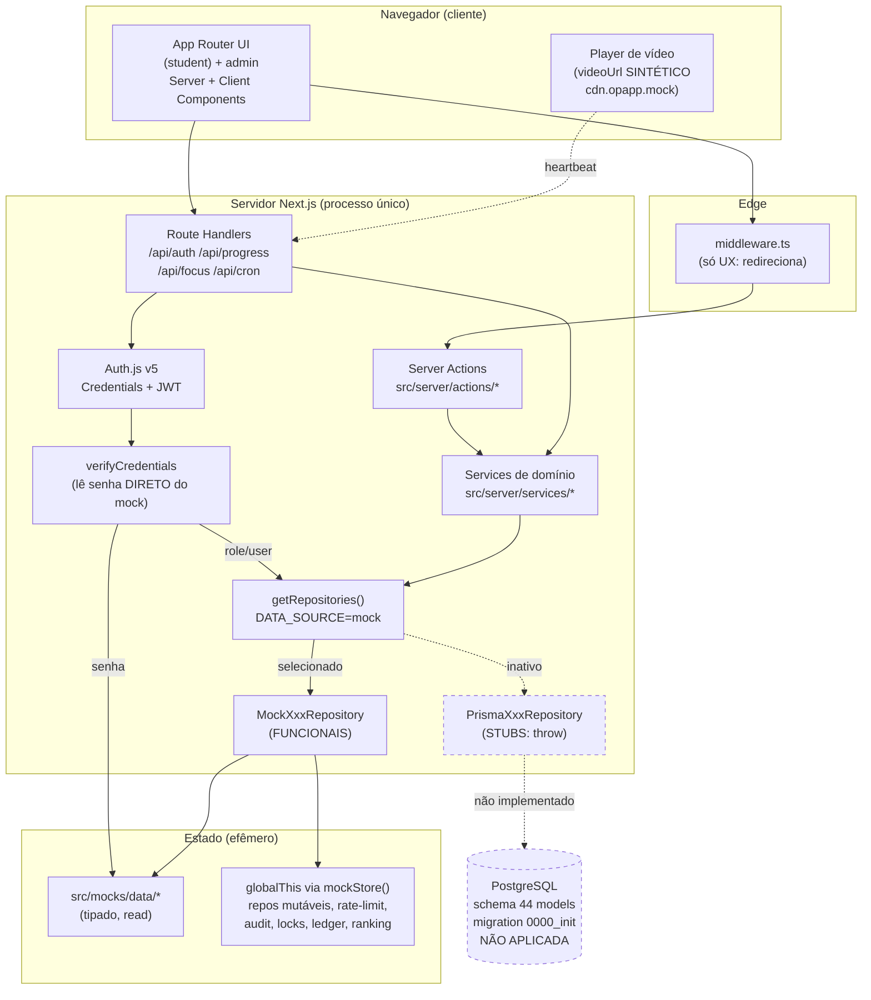

# Estado Atual — Auditoria de Produção (Operação Aprovação)

> Produzido pelo subagente `architect` como parte da preparação para tirar a aplicação do
> modo mock e habilitar usuários reais. Este documento é uma **auditoria verificada no
> código** (não presume que algo esteja pronto só porque a UI existe). Fonte de verdade do
> ESTADO ATUAL; a arquitetura-alvo está em [`TARGET_ARCHITECTURE.md`](./TARGET_ARCHITECTURE.md)
> e a matriz de ambientes em [`ENVIRONMENTS.md`](./ENVIRONMENTS.md).

## 0. Resumo executivo

A aplicação está **100% em modo mock** (`DATA_SOURCE=mock`, default em `src/config/env.ts`).
Toda a experiência do aluno e do admin é **interação real de aplicação** (chama Server
Actions / services / repositories, muta estado), mas o estado vive em **mocks tipados**
(`src/mocks/data/*`) e em **stores mutáveis em `globalThis`** (`mock-store.ts`), não num banco.
O padrão Repository (ADR-0002) isola a origem dos dados: existe uma interface por domínio,
uma implementação mock **funcional** e uma implementação Prisma que é **stub** (todos os
métodos fazem `throw new Error("not implemented: ...")`).

Consequência prática: **virar `DATA_SOURCE=prisma` hoje quebra a aplicação inteira** (todo
repositório lança) — a migração para produção não é "flipar uma flag", é **implementar os ~34
`PrismaXxxRepository`**, ligar o singleton do Prisma Client, aplicar a migration, e resolver os
bloqueadores de auth/estado-em-memória descritos abaixo.

- **44 models Prisma** modelados (`prisma/schema.prisma`, 1129 linhas) + `seed.ts` idempotente + migration inicial `0000_init` **NÃO aplicada** (sem PostgreSQL no ambiente).
- **Prisma 7** com driver adapter (`@prisma/adapter-pg`): `datasource` sem `url` no schema; URL em `prisma.config.ts`; client gerado em `src/generated/prisma/` (fora de `node_modules`).
- **741 testes (Vitest), mocks-first**, 105 arquivos de teste em `tests/unit/`. Sem e2e real. Sem CI configurado no repositório.
- **Auth.js v5 (NextAuth) Credentials + JWT** — mas a verificação de senha lê **direto do mock**, sem passar pelo `UserRepository`/`DATA_SOURCE` (bloqueador #1).

## 1. Bloqueadores reais que impedem produção (verificados)

| # | Bloqueador | Evidência no código | Severidade |
|---|---|---|---|
| 1 | **Senha validada direto do mock, incondicional.** `verifyCredentials` importa `mockCredentials`/`DEV_PASSWORD_HASH` de `@/mocks` e nunca consulta o repositório para o hash. Senha de dev `senha123` conhecida (documentada no próprio mock). Ligar `DATA_SOURCE=prisma`: (a) usuários reais nunca logam; (b) qualquer e-mail que exista no mock vira **backdoor com `senha123`**. | `src/server/auth/credentials-service.ts:2,21,26,30`; `src/mocks/data/credentials.ts` | **Crítico** |
| 2 | **Todos os `PrismaXxxRepository` são stubs** — `throw new Error("not implemented")`. Só as impl mock funcionam. Não há `src/server/db` (singleton `PrismaClient` + adapter). | `src/server/repositories/prisma/*` (ex.: `user-repository.ts:12-33`); `index.ts:168` seleciona por `DATA_SOURCE` | **Crítico** |
| 3 | **Migration `0000_init` nunca aplicada** e client Prisma nunca gerado neste ambiente (sem PostgreSQL). `db:seed` não roda sem `DATABASE_URL` real. | `prisma/migrations/0000_init/migration.sql`; `docs/DATA-MODEL.md` §6 | **Crítico** (infra) |
| 4 | **Auditoria só em memória.** `auditLog()` faz `push` num array + `console.info`; `/admin/auditoria` lê desse array. Não persiste entre restarts/instâncias. `AuditLog` existe no schema mas não está ligado. | `src/server/audit/log.ts:18-36` | **Alto** |
| 5 | **Rate limit de login em `globalThis`** (Map em memória por processo). Não sobrevive a múltiplas instâncias/serverless. | `src/server/auth/rate-limit.ts:26` (`mockStore(...)`) | **Alto** |
| 6 | **Todo estado mutável vive em `globalThis`** via `mockStore()` (repos mock, locks de flashcard/foco, ledger de gamificação, ranking). Serverless multi-instância não compartilha esse estado; reinícios zeram tudo. | `src/server/repositories/mock/mock-store.ts` | **Alto** (some ao migrar p/ Prisma) |
| 7 | **Sem hospedagem de vídeo.** `videoUrl` é gerado sinteticamente: `` `https://cdn.opapp.mock/videos/${lesson.id}.mp4` `` (host inexistente). Sem provider/upload/CDN. | `src/server/services/study-tracking/lesson-view.ts:91` | **Alto** (bloqueia produto) |
| 8 | **Sem e-mail transacional.** Não há envio de e-mail (verificação de conta, recuperação de senha, notificações). Não existem páginas/actions de **registro** nem **recuperação de senha** — só `login`. | `src/app/(auth)/` só tem `login/`; nenhuma dependência de e-mail em `package.json` | **Alto** |
| 9 | **Sem storage** para materiais de aula, avatares e capas (upload). Rota `/api/uploads` prevista na arquitetura, **não existe** em `src/app/api/`. | `src/app/api/` = `auth`, `cron`, `focus`, `progress` apenas | **Médio** |
| 10 | **Concorrência otimista de `MockExamAttempt` (`version`) não implementada contra banco real** — hoje é só documentação/mock. | `docs/DATA-MODEL.md` §5; `docs/SECURITY.md` §3 item 4 | **Médio** |
| 11 | **Sem CI/CD.** Nenhum workflow no repositório; validações (`lint/typecheck/test/build`) rodam só localmente. | ausência de `.github/workflows` | **Médio** |
| 12 | **CSP com `'unsafe-inline'` em `script-src`** (sem nonce). TODO já registrado. | `next.config.ts`; `docs/SECURITY.md` §5 | **Baixo** |

## 2. Tabela de auditoria por módulo

Legenda de prioridade: **P0** = bloqueia ligar Prisma / produção; **P1** = necessário para usuários reais; **P2** = necessário para o produto ser utilizável; **P3** = hardening/escala.

| Módulo | Estado atual | Origem dos dados | Dependência de mock | Risco | Alteração necessária | Agente responsável | Prioridade |
|---|---|---|---|---|---|---|---|
| **Auth (login/sessão)** | Interação REAL: Auth.js v5 Credentials + JWT, `loginAction` valida com Zod, rate-limit, audita, respeita `isActive`. Sem registro/recuperação de senha. | Senha: mock **incondicional** (`credentials-service`). Dados do usuário: `UserRepository` (respeita `DATA_SOURCE`). | **Total na senha** (`@/mocks/data/credentials`, `senha123`). | **Crítico**: backdoor + login real quebrado ao ligar Prisma. | Mover leitura de hash para `UserRepository.findCredentialsByEmail`; import de mock condicional; manter timing-defense em ambas impl; teste de regressão; implementar registro + recuperação de senha (depende de e-mail). | security, backend | **P0** |
| **Users** | Interação REAL: `findById/findByEmail/list/updateRole/setActive`. | `MockUserRepository` (`src/mocks/data/users.ts`). | Total. | Alto: Prisma repo é stub; mapear `Role` pt-BR ↔ `SystemRole` (enum Prisma). | Implementar `PrismaUserRepository` (+ mapeamento de enum). | database, backend | **P0** |
| **Profiles / privacidade** | Interação REAL: perfil + flags `isProfilePublic/showInRanking/showRealName/showCityState`. | `MockProfileRepository` (`profiles.ts`). | Total. | Médio: exposição de dado pessoal se flags não respeitadas nas queries. | Implementar `PrismaProfileRepository`; garantir respeito às flags na projeção. | database, backend, security | **P1** |
| **Courses / Modules / Lessons** | Interação REAL: hierarquia, ordenação, navegação por slug, páginas integradas. | `MockCourse/Module/Lesson/Subject/Topic/Teacher/ContestRepository` (`courses.ts`, `modules.ts`, etc.). | Total. | Médio: stubs Prisma; `order` único por pai. | Implementar os `Prisma*Repository` de conteúdo. | database, backend | **P1** |
| **Progresso de aula / vídeo** | Interação REAL: heartbeat (`/api/progress/heartbeat`), reconstrução server-side, conclusão ≥ 80% configurável, emite evento. | `MockLessonProgressRepository`; heartbeats em `globalThis`. `videoUrl` sintético. | Total + `globalThis`. | Alto: estado de heartbeat some em restart/multi-instância; sem vídeo real. | Persistir `LessonProgress`/`StudyActivity` no Prisma; escolher provider de vídeo. | study-tracking, backend, database | **P1** (dados) / **P2** (vídeo) |
| **Tempo válido de estudo** | Interação REAL: `validSeconds` reconstruído de heartbeats (não `fim−início`), detecta saltos/aba oculta/duplicados. | `MockStudySessionRepository` + `globalThis`. | Total. | Alto: anti-fraude depende de persistência real dos sinais. | Implementar repos Prisma de `StudySession`/`StudyActivity`. | study-tracking, database | **P1** |
| **Simulations (simulados)** | Interação REAL: criar tentativa, responder, correção server-side (gabarito não exposto antes), resultado. | `MockMockExam/Question/QuestionOption/Attempt/QuestionAttempt/FavoriteRepository`. | Total. | Médio/Alto: dupla finalização (concorrência otimista `version`) só documentada; `isCorrect` não pode vazar. | Implementar repos Prisma; escrever `UPDATE ... WHERE status='IN_PROGRESS' AND version=?`; garantir projeção sem `isCorrect`. | simulations, backend, database, security | **P1** |
| **Flashcards (SM-2)** | Interação REAL: baralhos, revisão, `nextReviewAt`/`easeFactor` server-side, `FlashcardReview` append-only. | `MockFlashcard*Repository` + locks em `globalThis`. | Total. | Médio: cálculo SM-2 nunca aceito do cliente. | Implementar repos Prisma; locks distribuídos ou transação. | backend, database | **P2** |
| **Brainstorm (Kanban)** | Interação REAL: quadros/colunas/cartões, mover, converter. | `MockBrainstorm*Repository`. | Total. | Médio: janela de corrida ao mover cartão sob concorrência (sem `@unique`). | Implementar repos Prisma; mover cartão em transação única. | backend, database | **P2** |
| **Study-plan (montar/plano)** | Interação REAL: planos, itens com FKs opcionais a Subject/Topic/Lesson. | `MockStudyPlan/Item/MissionRepository`. | Total. | Baixo. | Implementar repos Prisma. | study-tracking, database | **P2** |
| **Study-tracking (metas/sequência/calendário)** | Interação REAL: streak, metas diárias/semanais. | `MockUserStreak/DailyGoal/WeeklyGoalRepository`. | Total. | Baixo. | Implementar repos Prisma. | study-tracking, database | **P2** |
| **Gamification (pontos/XP/nível)** | Interação REAL: outbox — eventos emitidos em transação, consumidor idempotente grava `GamificationEvent`+`PointTransaction` com `idempotencyKey`. | `MockGamificationEvent/PointTransactionRepository` + ledger em `globalThis`. | Total + `globalThis`. | Alto: idempotência real depende dos `@unique` do schema (não de "checar antes de inserir"). | Implementar repos Prisma; garantir `@unique idempotencyKey`; transações reais. | gamification, backend, database | **P1** |
| **Ranking** | Interação REAL (leitura): `RankingScore` materializado, recálculo via `/api/cron/ranking-recalc` (protegido por `CRON_SECRET`, corpo validado por Zod). | `MockRankingScoreRepository` + recálculo em `globalThis`. | Total + `globalThis`. | Alto: cron sem runtime residente; recálculo precisa de banco e scheduler. | Implementar `PrismaRankingScoreRepository`; agendar cron (Vercel Cron). | gamification, backend, database | **P1** |
| **Achievements** | Interação REAL: `UserAchievement @@id([userId,achievementId])` (não duplica). | `MockAchievement/UserAchievementRepository`. | Total. | Baixo. | Implementar repos Prisma. | gamification, database | **P2** |
| **Notifications** | Interação REAL: `NotificationRepository`, contagem/lista de não lidas. Sem entrega real (in-app apenas). | `MockNotificationRepository`. | Total. | Baixo/Médio: sem push/e-mail; só in-app. | Implementar repo Prisma; (opcional) e-mail/realtime. | backend, database | **P2** |
| **Subscriptions** | Modelado no schema (`Subscription`) + seed; **sem interface de repositório, sem service, sem webhook**. Rota `/api/webhooks/subscriptions` prevista na arquitetura, **inexistente**. | Só schema/seed. | Só schema. | Médio: cobrança/planos não implementados. | Definir provider de pagamento; criar repo/service/webhook. | backend, database, architect | **P3** |
| **Admin** | Interação REAL: dashboard, gestão de usuários/conteúdo, matriz de papéis (`roles.ts`), `withAdminAudit` chama `requireRole` antes do handler. | Repos mock; auditoria em memória. | Total. | Alto: auditoria não persiste. | Implementar repos Prisma; ligar auditoria ao banco. | backend, security, database | **P1** |
| **Audit** | Interação REAL na chamada; **persistência falsa** (array em memória + console). | `globalThis`/array. | Total. | Alto: sem trilha de auditoria em produção. | Criar `PrismaAuditLogRepository`; `auditLog()`/`getAuditRecords()` → banco. | security, backend, database | **P1** |
| **Storage / Vídeo / E-mail** | **Inexistente.** Vídeo sintético; sem upload; sem e-mail. | Nenhuma (URLs sintéticas). | N/A. | Alto: produto não entrega vídeo; sem recuperação de senha. | Escolher provider de vídeo; Supabase Storage p/ materiais/avatares; e-mail transacional. | backend, architect, database | **P2** (vídeo/storage) / **P1** (e-mail p/ senha) |
| **Config / Env** | REAL: `src/config/env.ts` (Zod), `business.ts`. Falha o boot em produção se `AUTH_SECRET`/`CRON_SECRET` forem os defaults de dev. | Env vars. | Nenhuma. | Baixo: faltam vars de DB pooling, storage, e-mail, vídeo. | Ampliar schema Zod (`DIRECT_URL`, storage, e-mail, vídeo); ver §3. | architect, backend | **P0** (DB) / **P1** (resto) |
| **Testes / CI** | 741 testes Vitest (unit), mocks-first, 105 arquivos. Sem e2e real, sem CI, sem testes contra Postgres. | Mocks. | Total. | Médio: nenhum teste exercita `PrismaRepository` real. | Testes de integração contra Postgres (test branch); e2e; pipeline CI. | tester | **P1** |

**Total: 21 módulos auditados.**

## 3. Variáveis de ambiente

Hoje `src/config/env.ts` valida (Zod) apenas: `NODE_ENV`, `DATA_SOURCE`, `AUTH_SECRET`, `CRON_SECRET`.
`DATABASE_URL` é lida por `prisma.config.ts` (CLI) e será exigida pelo `PrismaPg` em runtime — mas **ainda não está no schema Zod** de `env.ts`. Variáveis esperadas na migração (a ampliar no `env.ts`):

| Variável | Hoje | Alvo produção |
|---|---|---|
| `NODE_ENV` | validada | `production` |
| `DATA_SOURCE` | validada, default `mock` | `prisma` |
| `AUTH_SECRET` | validada; boot falha se default em prod | segredo forte por ambiente |
| `CRON_SECRET` | validada; boot falha se default em prod | segredo forte por ambiente |
| `DATABASE_URL` | só em `.env`/`prisma.config.ts` | **pooled** (Supabase Supavisor `:6543` + `pgbouncer=true`) — adicionar ao `env.ts` |
| `DIRECT_URL` | **não existe** | **direta** (`:5432`) p/ migrations/seed — adicionar |
| Storage (ex.: `SUPABASE_URL`, `SUPABASE_SERVICE_ROLE_KEY`) | não existe | necessária p/ Supabase Storage |
| E-mail (ex.: `EMAIL_API_KEY`, `EMAIL_FROM`) | não existe | necessária p/ recuperação de senha/notificações |
| Vídeo (provider a decidir) | não existe | necessária p/ hospedagem/streaming |

## 4. Solução de autenticação atual (verificada)

- **Auth.js (NextAuth v5), Credentials Provider, sessão JWT** — sem tabela de sessão; cookie `authjs.session-token` (httpOnly, assinado com `AUTH_SECRET`) carrega `userId`/`role`.
- `src/middleware.ts` (Edge) é **só UX** (redireciona não-autenticado, separa `(student)` de `admin`). Autorização real é server-side (`requireUser`/`requireRole`/`assertOwnership` em `src/server/authorization/`).
- **O `role` nunca vem do cliente** — `loginSchema` descarta campos extras; `verifyCredentials` obtém o papel do repositório.
- **Falha única:** o **hash da senha** é lido do mock incondicionalmente (bloqueador #1). Tudo o mais da auth já respeita `DATA_SOURCE`.

## 5. Páginas realmente integradas

Todas as rotas do aluno (`dashboard`, `trilha`, `cursos/[slug]/modulos/[moduleSlug]/aulas/[lessonId]`, `simulados`, `flashcards`, `brainstorm`, `plano-de-estudos`, `montar-estudo`, `acompanhamento`, `modo-foco`, `ranking`, `conquistas`, `perfil`) e o `admin` chamam services/actions reais sobre os repositórios mock — **não são telas estáticas**. O que falta não é integração de UI, é **persistência real** por baixo.

## 6. Diagrama — Arquitetura ATUAL (mock-first)

