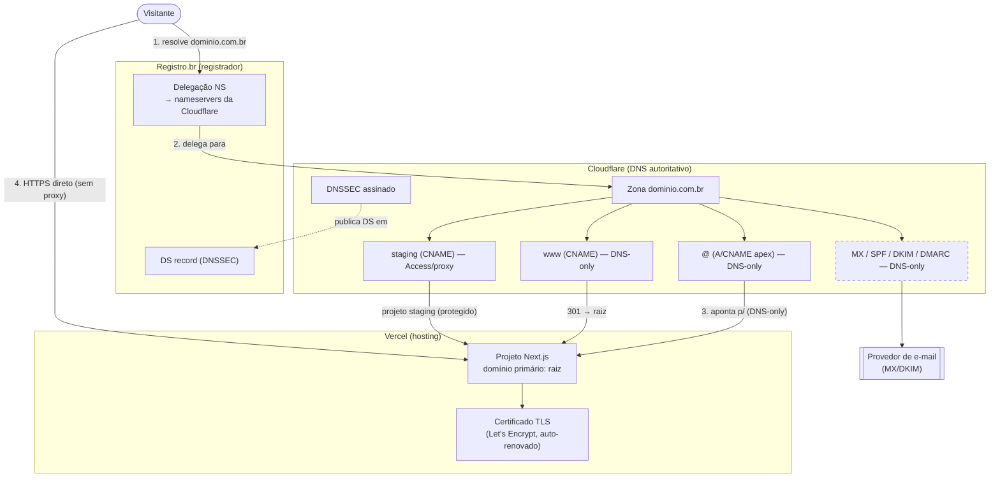

# Domínio e DNS — Produção (Operação Aprovação)

> Produzido pelo subagente `security`. Fluxo **Registro.br (registrador) → Cloudflare (DNS
> autoritativo) → Vercel (hosting)**. Complementa `CLOUDFLARE_PLAN.md` (regra do proxy laranja)
> e `ENVIRONMENTS.md` (staging protegido). **Não inventa os valores finais dos registros da
> Vercel** — eles devem ser copiados do painel do projeto na Vercel no momento da configuração.

---

## 1. Recomendação — app na RAIZ vs `app.`

**Recomendação: servir a aplicação na RAIZ (`dominio.com.br`) + `www` como alias, no MVP.**

Justificativa:
- **Um projeto Vercel, um certificado, uma superfície** — menos pontos de falha na validação/SSL.
- **Marketing e produto no mesmo domínio** simplificam links, SEO e memorização — o público-alvo
  (candidatos a concurso) acessa direto `dominio.com.br` e já cai no login/dashboard.
- Não há hoje um site institucional separado que justifique isolar a app em `app.` — a landing e a
  aplicação convivem no mesmo Next.js.
- **`app.` faz sentido depois** se/quando surgir um site institucional/blog pesado e independente
  (CMS, marketing) que se beneficie de cache agressivo — aí a app vai para `app.` e a raiz vira
  institucional. Migração é simples (adicionar subdomínio na Vercel + registro DNS). Deixado como
  melhoria posterior (🟢 no `SECURITY_CHECKLIST`, item X4).

## 2. Estrutura de subdomínios recomendada

| Subdomínio | Uso | Recomendação | Ambiente |
|---|---|---|---|
| **raiz** `dominio.com.br` | Aplicação (landing + login + app) | **SIM** — app na raiz | production |
| **`www`** | Alias → redireciona 301 para a raiz | **SIM** | production |
| **`admin.`** | Painel administrativo | **NÃO (por ora)** — o admin já vive em `/admin` na mesma app, protegido por `requireRole` + middleware. Um subdomínio separado exigiria segundo projeto/deploy e não agrega segurança real (a autorização é server-side, não por host). Reavaliar só se o admin virar app separada. | — |
| **`staging.`** | Pré-produção / QA | **SIM** — protegido (Cloudflare Access **ou** Basic Auth) + `noindex`. Nunca público, nunca indexável (`ENVIRONMENTS.md` §1.3). | staging |
| **`dev.`** | Integração compartilhada (interno) | **SIM (opcional)** — interno, restrito ao time. | development |
| **`status.`** | Página de status/uptime | **SIM (recomendado)** — hospedada externamente (ex.: provedor de status/uptime), não na Vercel; mantém a página de status no ar mesmo se a app cair. | externo |

## 3. Os 15 passos (Registro.br → Cloudflare → Vercel)

1. **Registrar/confirmar o domínio** `.com.br` no **Registro.br** (titularidade correta — CPF/CNPJ da empresa).
2. **Adicionar o site na Cloudflare** ("Add a site"), plano a escolher (verificar no painel).
3. **Deixar a Cloudflare escanear** os registros existentes e conferir a lista importada.
4. **Copiar os 2 nameservers** que a Cloudflare atribuir (ex.: `x.ns.cloudflare.com` / `y.ns.cloudflare.com`).
5. **No Registro.br**, em "Servidores DNS" → "Alterar Servidores DNS" → "Informar servidores DNS", **substituir os NS pelos da Cloudflare** e salvar. (Isto torna a Cloudflare autoritativa — propagação de minutos a ~24h.)
6. **Adicionar o domínio na Vercel** (projeto → Settings → Domains): adicionar `dominio.com.br` e `www.dominio.com.br`.
7. **Validar propriedade / obter os alvos de DNS na Vercel** — a Vercel exibirá os registros exatos a criar (um `A` para a raiz e/ou um `CNAME` para `www`). **Copiar esses valores do painel — não inventar.**
8. **Raiz (`@`)** — criar na Cloudflare o registro que a Vercel indicar para o apex (tipicamente um `A` para o IP de apex da Vercel, ou CNAME flattening no apex se a Vercel indicar um CNAME). **Proxy DNS-only (cinza)** — ver `CLOUDFLARE_PLAN.md` §1.
9. **`www`** — criar `CNAME www → <alvo indicado pela Vercel>` (tipicamente `cname.vercel-dns.com`, **confirmar no painel**). **DNS-only.**
10. **Definir o principal** — na Vercel, marcar `dominio.com.br` (raiz) como domínio primário e `www` como redirect 301 para a raiz (ou o inverso, se preferir `www` canônico — manter consistência).
11. **Redirecionar o secundário** — se houver domínio secundário (ex.: `.com` além de `.com.br`), apontar para o principal via redirect 301 (na Vercel ou Cloudflare Redirect Rules — em um lugar só).
12. **Validar SSL** — aguardar a Vercel emitir o certificado (Let's Encrypt) para raiz e `www`; confirmar cadeado válido em ambos. Em DNS-only isto ocorre sem interferência da Cloudflare.
13. **Testar DNS** — resolver `dominio.com.br` e `www` (`nslookup`/`dig`) e confirmar que apontam para a Vercel; validar propagação global.
14. **Testar renovação de certificado** — confirmar que a Vercel gerencia a renovação automática (deixar DNS-only garante que a validação ACME não é interceptada); registrar alerta de expiração no monitoramento (`MONITORING_PLAN.md`).
15. **Registros de e-mail sem quebrar o site** — adicionar `MX`, `SPF` (TXT), `DKIM` (TXT/CNAME conforme o provedor de e-mail) e `DMARC` (TXT `_dmarc`) **sem alterar** os registros `A`/`CNAME` do site. Registros de e-mail sempre **DNS-only** (proxy laranja nunca em MX). Se usar provedor transacional (Resend/Postmark/SES — ver `TARGET_ARCHITECTURE.md` §5), adicionar os registros de verificação/DKIM que ele fornecer.

> **DNSSEC:** após o passo 5, ativar DNSSEC na Cloudflare e publicar o **DS record** no Registro.br
> (seção DNSSEC do domínio). Fazer **depois** que a Cloudflare já for autoritativa e o site estiver
> resolvendo, para não arriscar indisponibilidade durante a troca de NS.

## 4. Tabela DNS (modelo)

> Valores marcados `<da Vercel>` **devem vir do painel do projeto na Vercel** — não fixar aqui.
> Todos os registros do site iniciam **proxy OFF (DNS-only)** conforme `CLOUDFLARE_PLAN.md` §1.

| Nome | Tipo | Destino | Proxy Cloudflare | Finalidade | Ambiente |
|---|---|---|---|---|---|
| `@` (raiz) | A (ou CNAME flatten) | `<IP/alvo de apex da Vercel>` | **OFF (cinza)** | App principal | production |
| `www` | CNAME | `<cname.vercel-dns.com — confirmar>` | **OFF (cinza)** | Alias → 301 p/ raiz | production |
| `staging` | CNAME | `<alvo da Vercel p/ projeto staging>` | **ON (só p/ Cloudflare Access)** ou OFF (se Basic Auth) | Pré-produção protegida + `noindex` | staging |
| `dev` | CNAME | `<alvo da Vercel p/ projeto dev>` | OFF | Integração interna | development |
| `status` | CNAME | `<host do provedor de status>` | OFF | Página de status/uptime | externo |
| `@` / `mail` | MX | `<host MX do provedor de e-mail>` | **OFF (obrigatório)** | Recebimento de e-mail | production |
| `@` | TXT (SPF) | `v=spf1 include:<provedor> -all` | OFF | Anti-spoofing de envio | production |
| `<selector>._domainkey` | TXT/CNAME (DKIM) | `<valor do provedor>` | OFF | Assinatura DKIM | production |
| `_dmarc` | TXT (DMARC) | `v=DMARC1; p=quarantine; rua=mailto:<contato>` | OFF | Política DMARC | production |
| `_cf-custom-hostname` / verificação | TXT | `<valor de verificação, se solicitado>` | OFF | Validação de propriedade (Vercel/e-mail) | conforme |

## 5. Caveat do proxy laranja (repetido — regra dura)

**Todos os registros do site começam DNS-only (cinza).** A Vercel não recomenda reverse proxy na
frente dela; o proxy laranja pode quebrar validação/renovação de certificado, duplicar cache e
esconder o IP de origem. Só ativar o proxy (registro a registro) **após** o site estar 100% no ar,
com SSL validado, seguindo o fluxo documentado em `CLOUDFLARE_PLAN.md` §1 (Cache Bypass,
True-Client-IP, SSL Full strict, O2O off). Registros **MX nunca** recebem proxy.

## 6. Diagrama — fluxo de DNS / resolução

O caminho do visitante em DNS-only: **resolve na Cloudflare → conecta direto na Vercel por HTTPS**
(a Cloudflare responde só a consulta de DNS, não intermedia o tráfego). Ligar o proxy laranja
insere a Cloudflare **no caminho do tráfego** — decisão pós-lançamento (`CLOUDFLARE_PLAN.md`).
