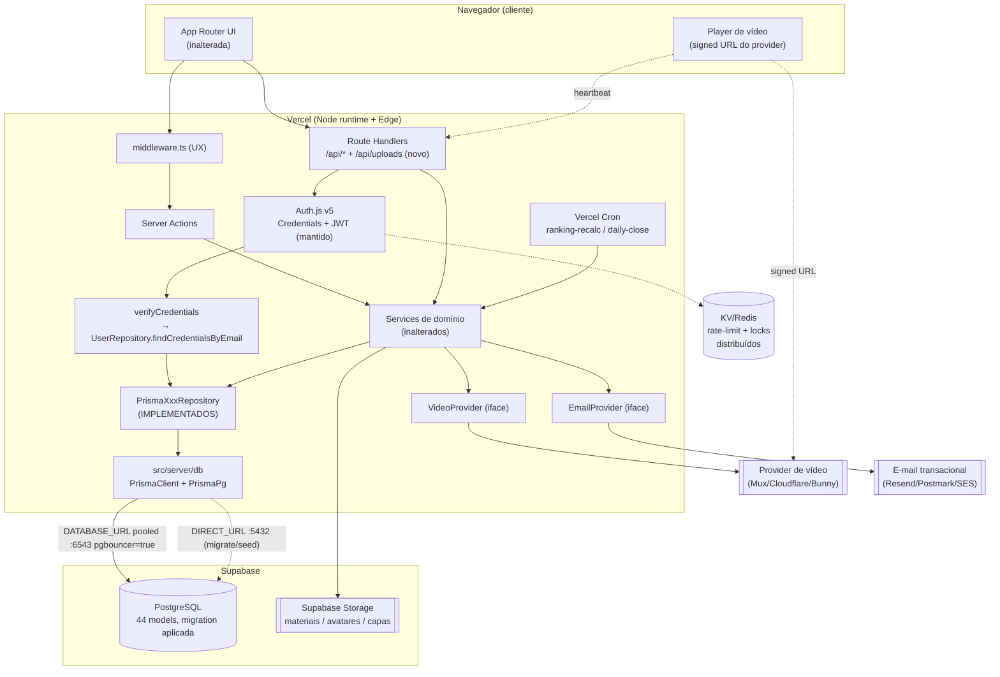

# Arquitetura-Alvo — Produção (Operação Aprovação)

> Produzido pelo subagente `architect`. Recomenda a arquitetura para usuários reais.
> Complementa [`CURRENT_STATE.md`](./CURRENT_STATE.md) (o que existe hoje) e
> [`ENVIRONMENTS.md`](./ENVIRONMENTS.md) (matriz de ambientes). Os planos específicos de
> banco, backend e segurança serão detalhados pelos agentes `database`, `backend` e
> `security` — este doc define as fronteiras e o que muda vs. o que permanece.

## 1. Stack-alvo (resumo)

| Camada | Escolha | Papel |
|---|---|---|
| Hosting / runtime | **Vercel** (Next.js 16, Node.js runtime — 20.x/22.x LTS; **verificar versão exata no painel**) | Server Components, Server Actions, Route Handlers, Vercel Cron |
| Banco gerenciado | **Supabase (PostgreSQL)** | Persistência via Prisma; pooling serverless (Supavisor) |
| ORM | **Prisma 7** + `@prisma/adapter-pg` (`PrismaPg`) | Já modelado (44 models); só implementar os `PrismaXxxRepository` |
| Auth | **Auth.js v5 (NextAuth), Credentials + JWT** — **mantido** | Migrar apenas a FONTE de credenciais: mock → `UserRepository`/DB |
| Storage | **Supabase Storage** | Materiais de aula, avatares, capas (uploads) |
| Vídeo | **provider dedicado a decidir pelo backend** (candidatos abaixo) | Hospedagem/streaming/proteção de vídeo |
| E-mail | **provedor transacional** (candidatos abaixo) | Recuperação de senha, verificação, notificações |
| Estado efêmero (rate-limit/locks) | **KV/Redis gerenciado** (ex.: Upstash) | Substitui os stores em `globalThis` que precisam sobreviver a multi-instância |

## 2. O que MUDA vs. o que PERMANECE

O padrão Repository (ADR-0002) foi desenhado exatamente para esta migração: services, actions,
contratos e UI dependem **só da interface** de repositório. Portanto:

**Permanece (sem tocar):**
- Toda a camada de apresentação (`src/app`, `src/components`, `features/*`).
- Contratos Zod (`src/contracts`) e o padrão `ActionResult<T>`.
- Services de domínio (`src/server/services/*`) — não conhecem Prisma nem HTTP.
- Autorização server-side (`requireUser`/`requireRole`/`assertOwnership`), matriz de papéis (`admin/roles.ts`), `withAdminAudit`.
- Modelo de auth (Auth.js v5 Credentials + JWT), middleware de UX, RBAC.
- Contrato dos stores efêmeros (a **interface pública** de `rate-limit.ts` etc. é preservada; muda só a impl).

**Muda:**
1. `DATA_SOURCE=mock` → `prisma` (por ambiente).
2. Implementar os ~34 `PrismaXxxRepository` (hoje stubs) + criar `src/server/db` (singleton `PrismaClient` com `PrismaPg`, guardado em `globalThis` no padrão anti-hot-reload).
3. **Auth:** mover a leitura do hash de senha para `UserRepository.findCredentialsByEmail` (mock e Prisma), tornando o import de `@/mocks/data/credentials` condicional a `DATA_SOURCE` (bloqueador #1).
4. **Auditoria:** `PrismaAuditLogRepository`; `auditLog()`/`getAuditRecords()` → banco.
5. **Rate-limit/locks:** de `globalThis` → KV/Redis distribuído (mesma interface).
6. **Vídeo/Storage/E-mail:** introduzir provedores atrás de interfaces novas (não existem hoje).
7. **Env:** ampliar `src/config/env.ts` (Zod) com `DATABASE_URL` pooled, `DIRECT_URL`, storage, e-mail, vídeo.
8. **CI/CD:** pipeline (`lint`/`typecheck`/`test`/`build` + migrations) e testes de integração contra Postgres.

## 3. Por que MANTER Auth.js v5 (e não trocar por Supabase Auth)

Recomendação: **manter Auth.js v5**. Justificativa:

1. **Já está implementado e endurecido.** Credentials + JWT, RBAC server-side, rate-limit, timing-defense, `isActive`, matriz de papéis, auditoria de admin e 741 testes assumem esse modelo. Trocar por Supabase Auth exigiria reescrever autenticação, autorização e boa parte dos testes — retrabalho grande sem ganho proporcional.
2. **A dívida real é pequena e localizada.** O único acoplamento a mock na auth é a **leitura do hash de senha** (`credentials-service.ts`). A correção é mover isso para o `UserRepository` — trabalho pontual, já especificado em `docs/SECURITY.md` §2.
3. **Independência de fornecedor.** Auth.js sobre o próprio `UserRepository` mantém identidade/senha no nosso Postgres (Supabase é "só" o Postgres gerenciado). Não amarra login ao GoTrue do Supabase; trocar de provedor de banco no futuro não obriga a migrar contas.
4. **RBAC pt-BR próprio.** O papel (`aluno/professor/moderador/admin`) e o mapeamento `Role ↔ SystemRole` já são nossos; Supabase Auth traria um modelo de claims/roles paralelo a reconciliar.
5. **Supabase Auth seria vantajoso só** se quiséssemos OAuth social/magic links/MFA prontos. Isso pode ser adicionado **depois** via provedores do próprio Auth.js, sem trocar a fundação.

Continuamos usando o Supabase **como PostgreSQL gerenciado + Storage**, não como provedor de identidade.

## 4. Prisma + Supabase — pooling serverless (fato técnico confirmado)

Em ambiente serverless (Vercel Functions), a Vercel abre/fecha muitas conexões curtas; o Postgres
esgota conexões rápido. Padrão recomendado (Supabase + Prisma):

- **`DATABASE_URL`** = string **pooled** via Supavisor, porta **`6543`**, com **`?pgbouncer=true`** (transaction mode não suporta prepared statements; a flag desliga isso no Prisma). Usada pelo `PrismaClient` em runtime.
- **`DIRECT_URL`** = conexão **direta**, porta **`5432`**. Usada pela **CLI do Prisma** (migrate/seed) — o pooler de transação **não** suporta o motor de migrations (DDL exige conexão persistente).
- Adicionar `directUrl` ao bloco `datasource` do schema (ou equivalente na config do Prisma 7) e as duas vars ao `env.ts`.

> Preços/limites de plano: **verificar no painel Supabase/Vercel** — não fixar aqui.

## 5. Candidatos a provedor (decisão do `backend`)

**Vídeo (hospedagem/streaming, proteção de URL, tracking de progresso compatível com heartbeat):**
- Mux (streaming + signed URLs + analytics);
- Cloudflare Stream (streaming + proteção por token);
- Bunny Stream (CDN + DRM leve, custo baixo);
- (evitar) armazenar `.mp4` cru em Storage sem streaming adaptativo — ruim para vídeo longo.

Requisito de arquitetura: abstrair atrás de uma interface (`VideoProvider`) para não acoplar o domínio ao fornecedor — espelha o padrão Repository.

**E-mail transacional:** Resend, Postmark, AWS SES, SendGrid. Abstrair atrás de `EmailProvider`.

**KV/Redis (rate-limit/locks distribuídos):** Upstash Redis (integra bem com Vercel/serverless), Vercel KV.

## 6. Camadas e fronteiras (alvo)

Mesma regra de dependência de hoje (setas para dentro): **UI → contratos/actions → services → repositories (interface)**. Novos provedores (vídeo/e-mail/storage/KV) entram como **infra transversal** atrás de interfaces, chamados pelos services — nunca pela UI, nunca importados diretamente fora da sua pasta de infra. Proibição mantida: `@prisma/client` só em `server/repositories/prisma/**` e `server/db`.

## 7. Diagrama — Arquitetura PROPOSTA

