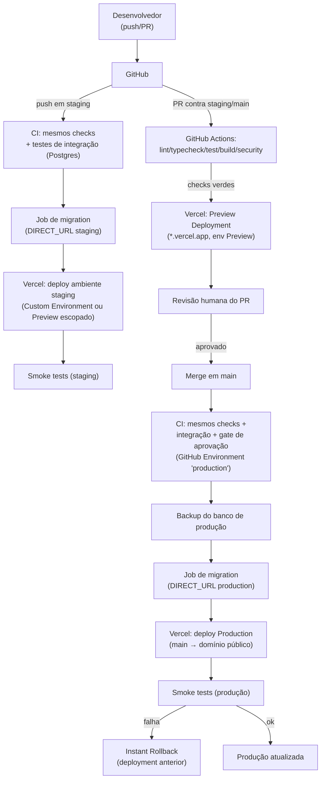

# Deploy na Vercel — Operação Aprovação

> Produzido pelo subagente `backend`. Complementa [`TARGET_ARCHITECTURE.md`](./TARGET_ARCHITECTURE.md)
> (Vercel como hosting-alvo) e [`ENVIRONMENTS.md`](./ENVIRONMENTS.md) (matriz de 4 ambientes).
> Detalha especificamente a publicação na Vercel: conexão com GitHub, mapeamento de branches para
> ambientes, comandos, estratégia de migration, segredos e rollback. O pipeline de CI que
> antecede o deploy está em [`CI_CD.md`](./CI_CD.md).

## 1. Conexão com GitHub e branches → ambientes

Conectar o repositório GitHub ao projeto Vercel (Import Project). Mapeamento de branch:

| Branch | Ambiente Vercel | Domínio | Corresponde a (`ENVIRONMENTS.md`) |
|---|---|---|---|
| `main` | **Production** | domínio público definitivo | `production` |
| `staging` | **Preview** com domínio fixo, ou **Custom Environment "staging"** (Pro/Enterprise) | `staging.<dominio>` (protegido, `noindex`) | `staging` |
| qualquer outra branch / PR | **Preview** (efêmero, um deployment por push) | `*.vercel.app` gerado por deployment | equivalente a `development` |
| local (`next dev`) | — (não é deployment Vercel) | `localhost:3000` | `local` |

**Nota sobre "staging" na Vercel:** por padrão, toda branch que não é a de produção cai no
ambiente genérico **Preview** — variáveis de ambiente de Preview são compartilhadas por todas as
branches, a menos que sejam explicitamente *escopadas* para a branch `staging` (disponível desde
o plano Hobby: "Preview" com env vars por branch). Nos planos **Pro/Enterprise**, a Vercel
oferece **Custom Environments**: um ambiente nomeado `staging` com domínio, variáveis de ambiente
e regras de branch próprias, deployável explicitamente com `vercel deploy --target=staging` —
essa é a configuração recomendada para este projeto, porque staging precisa de segredos e banco
completamente isolados de qualquer outro Preview (`ENVIRONMENTS.md` §1: "produção NUNCA
compartilha banco/storage/segredos com dev/staging" — o mesmo isolamento vale entre staging e
Previews genéricos). Se o projeto estiver num plano sem Custom Environments, a alternativa é
escopar todas as env vars sensíveis de staging à branch `staging` especificamente (Vercel
permite atribuir uma env var de Preview a uma branch específica) — funcionalmente equivalente,
menos explícito no dashboard. **Verificar no painel/plano contratado qual opção está disponível
— não presumir aqui.**

## 2. PR → Preview Deployments

Todo Pull Request aberto contra `staging` ou `main` gera automaticamente um **Preview
Deployment** (comentário do bot da Vercel no PR com a URL). Isso já cobre o requisito
"PR→preview deployments" nativamente, sem configuração adicional — cada push no PR gera um novo
deployment de preview. Ambiente de execução desse deployment: **Preview** (variáveis de ambiente
do tipo Preview, nunca as de Production).

## 3. Ambientes Development / Preview / Production (conceito Vercel)

| Conceito Vercel | Quando é usado | Variáveis de ambiente | Branch |
|---|---|---|---|
| **Development** | `vercel dev` local, ou `vercel env pull` para popular `.env.local` | escopo "Development" | qualquer (local) |
| **Preview** | deployments de PR e de qualquer branch não-produção | escopo "Preview" (globais ou escopadas por branch) | `staging` e demais |
| **Production** | deployment da branch de produção (`main`) | escopo "Production" | `main` |

Cada variável de ambiente na Vercel é cadastrada com um ou mais desses escopos marcados — nunca
usar o mesmo segredo (ex.: `AUTH_SECRET`) em mais de um escopo (`ENVIRONMENTS.md` §1 item 4).

## 4. Versão do Node.js

**Verificado (jul/2026):** a Vercel suporta atualmente Node.js **20.x, 22.x e 24.x** para
Builds/Functions. Node.js 20 atinge fim de vida upstream em 30/abr/2026 e a Vercel **descontinua
o Node 20 em Builds/Functions em 1/out/2026** (após essa data, projetos configurados em 20.x
passam a falhar novos deployments). Como este projeto está sendo preparado para produção agora,
**recomendação: fixar Node 22.x (LTS)** — evita a janela de descontinuação já anunciada e ainda
não exige o recém-liberado 24.x antes de validar compatibilidade com as dependências atuais
(Next.js 16.2, Prisma 7, `bcryptjs`, `@prisma/adapter-pg`).

Ação necessária (hoje `package.json` só declara `@types/node: ^20`, que são **apenas os tipos**
— não fixa a versão do runtime):
```jsonc
// package.json
"engines": { "node": "22.x" }
```
E confirmar/ajustar em **Project Settings → General → Node.js Version** no painel Vercel (a
configuração do painel tem precedência sobre `engines` para o runtime de Functions; manter os
dois em sincronia evita divergência entre o que roda local/CI — via `@types/node`/`nvm`/Volta —
e o que roda na Vercel).

## 5. Comandos de install/build

Padrão detectado automaticamente pela Vercel para projetos Next.js: `npm install` →
`npm run build`. Ajustes necessários neste projeto por causa do Prisma:

```jsonc
// package.json — scripts (proposta)
"scripts": {
  "postinstall": "prisma generate",   // NOVO — evita "Prisma Client desatualizado" no build
  "build": "next build",              // mantém como está; generate já rodou no postinstall
  // ...demais scripts inalterados
}
```

Justificativa do `postinstall`: é a forma recomendada pela documentação oficial do Prisma para
Vercel — como o cliente é gerado em `src/generated/prisma/` (fora de `node_modules`, Prisma 7 —
`CURRENT_STATE.md` linha 25) e cada build da Vercel é um ambiente novo, o `prisma generate`
**precisa** rodar a cada build; colocá-lo em `postinstall` garante que roda logo após
`npm install`, antes do `next build`, sem depender de lembrar de compor o comando de build.
`prisma generate` **não** requer conexão com o banco (só lê `schema.prisma`) — pode rodar mesmo
sem `DATABASE_URL` disponível no ambiente de build, mas requer `prisma`/`@prisma/client` como
dependências de **produção** (já são — ambos estão em `dependencies`, não `devDependencies`, no
`package.json` atual — correto, a Vercel poda `devDependencies` antes de alguns passos).

## 6. Estratégia de migrations do Prisma — NÃO rodar `migrate deploy` no build da Vercel

**Recomendação deste plano (padrão seguro): migrations NUNCA rodam dentro do build/deploy
automático da Vercel.** Motivos:

1. **Builds da Vercel não são um lugar seguro para DDL de produção.** Um build pode ser
   re-executado (retry automático), rodar em paralelo a outro (dois pushes próximos), ou ser
   cancelado no meio — nenhum desses cenários é aceitável para uma migration destrutiva contra o
   banco de produção. `migrate deploy` num hook de build não tem gate de aprovação humana nem
   ordenação garantida.
2. **Falha de migration quebraria o build de TODOS os pushes**, inclusive os que não têm nada a
   ver com schema — acoplamento desnecessário entre "publicar código" e "migrar schema".
3. **`DIRECT_URL` teria que ficar acessível ao runtime de build** — mais uma superfície de
   segredo exposta a um contexto (build) que idealmente só precisa de `DATABASE_URL` pooled em
   runtime.

**Estratégia adotada — job de migration separado no CI, antes do deploy de produção** (detalhado
em `CI_CD.md`):

- Um job dedicado do GitHub Actions roda `prisma migrate deploy` usando a `DIRECT_URL` do
  ambiente-alvo (staging ou production), **fora** do processo de build da Vercel.
- Esse job só executa **depois** de lint/typecheck/test/build passarem, e **antes** do deploy ser
  promovido a receber tráfego real (para produção, atrás de um gate de aprovação manual — ver
  `CI_CD.md` §3).
- Para produção especificamente: **backup do banco imediatamente antes** de qualquer `migrate
  deploy` (`ENVIRONMENTS.md` §4 item 5), e preferência por migrations **aditivas** (padrão
  expand/contract: adicionar coluna nullable → backfill → tornar not-null numa migration
  seguinte, nunca dropar/renomear numa única migration acoplada a um deploy) para que um rollback
  de **código** (seção 9) nunca deixe a aplicação antiga incompatível com o schema já migrado.
- Alternativa manual (gate mais forte, para mudanças de schema sensíveis): em vez do job de CI
  automático, um passo manual explícito — alguém com acesso à `DIRECT_URL` de produção roda
  `npm run db:migrate:deploy` localmente (ou via um workflow `workflow_dispatch` disparado à mão)
  seguindo o checklist de `ENVIRONMENTS.md` §4, e só then a promoção do deploy acontece. Usar
  este caminho para migrations destrutivas ou de alto risco; o job automático do CI cobre o caso
  comum (migrations aditivas revisadas em PR).
- `prisma generate` continua rodando no build normal (seção 5) — é geração de tipos/cliente, sem
  efeito no banco, seguro em todo build.

**O que evitar:** `"build": "prisma migrate deploy && next build"` (padrão comum em tutoriais,
mas que este projeto **deliberadamente não adota** pelos motivos acima).

## 7. Segredos

- Cadastrados em **Project Settings → Environment Variables** (dashboard) ou via `vercel env
  add <NOME> <ambiente>` (CLI) — nunca em arquivo commitado. `.env`/`.env.local` já estão fora do
  git (`.gitignore` — confirmado em `docs/SECURITY.md` §6); só `.env.example` é versionado, sem
  valores reais.
- Cada segredo cadastrado com o(s) escopo(s) corretos (Development/Preview/Production) — nunca
  reutilizar o mesmo valor de `AUTH_SECRET`/`CRON_SECRET`/`DATABASE_URL` entre Production e
  qualquer outro escopo (`ENVIRONMENTS.md` §1 item 4).
- Segredos usados pelo job de migration do CI (`DIRECT_URL` de staging/production) ficam em
  **GitHub Environment secrets** (não em Vercel) — detalhado em `CI_CD.md` §5.

## 8. URL / domínio temporário `.vercel.app`

Todo deployment (Preview ou Production) recebe uma URL única em `*.vercel.app` automaticamente —
útil para QA/smoke test antes de qualquer domínio próprio estar configurado. Ao configurar um
domínio customizado para `main` (Production), a URL `.vercel.app` de produção continua existindo
como alias secundário (não desativar; útil como fallback de diagnóstico). Para `staging`, manter
propositalmente **sem indexação** (`ENVIRONMENTS.md` §1 item 3: `X-Robots-Tag: noindex` +
Cloudflare Access ou Basic Auth) mesmo usando um domínio fixo.

## 9. Logs

- **Runtime Logs** no dashboard da Vercel (por deployment/função) e via `vercel logs
  <deployment-url>` (CLI) — janela de retenção depende do plano contratado (**verificar no
  painel** — não fixar um número aqui).
- Para retenção além da janela nativa da Vercel (auditoria de mais longo prazo, correlação entre
  ambientes), integrar um **Log Drain** (Vercel suporta encaminhar logs para um serviço externo)
  — decisão de qual serviço fica para quando a Fase 19 (hardening/observabilidade) do roadmap for
  detalhada; não incluído neste plano.
- Erros de aplicação (exceptions client/server) — ver Sentry na tabela de variáveis (seção 11):
  captura de erro é complementar aos Runtime Logs, não substitui.

## 10. Rollback

- **Instant Rollback** (recurso nativo da Vercel): no dashboard, em Deployments, selecionar um
  deployment de Production anterior e promovê-lo de volta ("Promote to Production" / botão de
  rollback) — reverte o tráfego para o build anterior **sem rebuild**, é quase instantâneo. Via
  CLI: `vercel rollback [deployment-url]`.
- **Rollback é só de código/build — nunca reverte o schema do banco.** Por isso a estratégia de
  migration (seção 6) prioriza mudanças aditivas: um rollback de código para uma versão anterior
  à migration só é seguro se essa versão anterior ainda funcionar contra o schema **já
  migrado** (coluna nova nullable não quebra código antigo que não a usa; uma coluna
  dropada/renomeada quebraria). Migrations destrutivas exigem coordenação manual e, no caso de
  emergência, restaurar o backup (seção 6) em vez de confiar só no rollback de deployment.
- Rollback de **Preview/staging** é mais simples (sem usuários reais) — normal re-disparar um
  deployment anterior ou simplesmente fazer um novo push corrigindo o problema.

## 11. Promoção staging → produção

Fluxo recomendado (alinhado ao pipeline de `CI_CD.md`):

1. PR de `staging` para `main` (ou da feature branch direto para `main`, dependendo do fluxo de
   branching adotado pelo time) — dispara Preview Deployment + checks de CI.
2. Todos os checks obrigatórios verdes (lint/typecheck/test/build/security — `CI_CD.md` §2).
3. Aprovação humana do PR (revisão de código) **+** aprovação do gate de ambiente `production`
   no GitHub (Environment protection rule) antes do job de migration/deploy de produção rodar.
4. Job de migration contra o banco de produção (seção 6), com backup imediatamente anterior.
5. Merge em `main` → Vercel builda e deploya Production (ou o deploy é disparado explicitamente
   pelo job de CI após a migration, conforme o padrão de sequenciamento escolhido — ver
   `CI_CD.md` §4 para as duas variantes).
6. Smoke tests contra a URL de produção (`CI_CD.md` §2) — falha aciona rollback (seção 10).

**Por que não usar "promote this exact staging build to production" (recurso de promoção
binária da Vercel) como caminho principal aqui:** o build gerado para staging foi compilado com
as variáveis de ambiente de staging (inclusive `NEXT_PUBLIC_*`, que são embutidas no bundle em
**tempo de build**, não lidas em runtime). Como `DATA_SOURCE`, segredos e (quando existirem)
chaves públicas de Turnstile/Sentry diferem entre staging e produção, **este projeto rebuilda
para cada ambiente** em vez de promover o binário de staging tal qual — mais seguro, evita
vazamento de configuração de um ambiente para o outro, ao custo de um build a mais.

## 12. Tabela de variáveis de ambiente

| Variável | Finalidade | Ambiente(s) | Secreta/Pública | Origem | Rotação necessária |
|---|---|---|---|---|---|
| `NODE_ENV` | Modo de execução (Next.js/Node) | Dev/Preview/Prod | Pública | Definida automaticamente pela plataforma | Não |
| `DATA_SOURCE` | Seleciona repositório mock vs Prisma (ADR-0002) | Dev/Preview/Prod (`prisma` em todos exceto local) | Pública | Configurada manualmente | Não |
| `AUTH_SECRET` | Assina/criptografa o JWT de sessão (Auth.js v5) | Dev/Preview/Prod — **valor distinto em cada um** | Secreta | Gerada (`crypto.randomBytes(32)`) | Sim — se vazar ou periodicamente (ex.: anual); rotacionar **invalida todas as sessões ativas** |
| `CRON_SECRET` | Autentica chamadas a `/api/cron/*` | Dev/Preview/Prod — distinto por ambiente | Secreta | Gerada | Sim — se vazar; ao rotacionar, atualizar também o scheduler externo que dispara o cron |
| `DATABASE_URL` | Conexão pooled (Supavisor `:6543`, `pgbouncer=true`) usada pelo `PrismaClient` em runtime | Dev/Preview/Prod — projeto/branch Supabase isolado por ambiente | Secreta | Painel Supabase (Connection Pooling) | Sim, se credencial de banco vazar; senão vinculada ao ciclo de vida do projeto Supabase |
| `DIRECT_URL` | Conexão direta (`:5432`) usada pela CLI do Prisma (migrate/seed) — **não usada em runtime da app**, só no job de migration do CI | CI (staging/prod) + local | Secreta | Painel Supabase | Igual a `DATABASE_URL` |
| `SUPABASE_URL` | Endpoint do projeto Supabase (Storage) | Dev/Preview/Prod | Pública (é a URL do projeto) | Painel Supabase | Não (muda só se o projeto for recriado) |
| `SUPABASE_SERVICE_ROLE_KEY` | Acesso privilegiado ao Supabase Storage (upload server-side) | Dev/Preview/Prod | Secreta | Painel Supabase (Service Role) | Sim — nunca exposta ao client; rotacionar se vazar |
| `EMAIL_PROVIDER` | Seleciona implementação de `EmailProvider` (`console` em dev/local) | Dev/Preview/Prod | Pública | Configurada manualmente | Não |
| `EMAIL_API_KEY` | Autentica com o provedor transacional (Resend/Postmark/SES — decisão Fase 14) | Preview (sandbox)/Prod (real) | Secreta | Painel do provedor escolhido | Sim — se vazar; provedores costumam permitir múltiplas chaves para rotação sem downtime |
| `EMAIL_FROM` | Endereço remetente dos e-mails transacionais | Preview/Prod | Pública | Definida pelo domínio verificado no provedor | Não |
| `VIDEO_PROVIDER` | Seleciona `VideoProvider` (Mux/Cloudflare Stream/Bunny — decisão Fase 13) | Dev/Preview/Prod | Pública | Configurada manualmente | Não |
| `VIDEO_API_KEY` / `VIDEO_SIGNING_SECRET` | Autenticação e assinatura de URL do provedor de vídeo | Preview/Prod | Secreta | Painel do provedor escolhido | Sim — assinatura de URL principalmente, se comprometida permite acesso indevido a vídeo |
| `TURNSTILE_SITE_KEY` | Chave pública do widget Cloudflare Turnstile (anti-abuso de login) | Dev/Preview/Prod | Pública (embutida no client) | Painel Cloudflare Turnstile | Não |
| `TURNSTILE_SECRET_KEY` | Valida o token do Turnstile no servidor | Dev/Preview/Prod | Secreta | Painel Cloudflare Turnstile | Sim — se vazar |
| `KV_REST_API_URL` / `KV_REST_API_TOKEN` (ou `UPSTASH_REDIS_REST_URL`/`_TOKEN`) | Store distribuído de rate-limit/locks (substitui `globalThis`) | Preview/Prod (dev pode continuar em `globalThis`) | Secreta (token) | Painel Upstash/Vercel KV | Sim — se vazar |
| `SENTRY_DSN` | Endpoint de captura de erros do client/server | Preview/Prod | Pública (DSN é seguro para expor, mas tratar como config sensível de infra) | Painel Sentry | Não, salvo troca de projeto Sentry |
| `SENTRY_AUTH_TOKEN` | Upload de source maps no build (não fica no bundle final) | CI (build) | Secreta | Painel Sentry (org-level token) | Sim — se vazar |
| `SENTRY_ORG` / `SENTRY_PROJECT` | Identificam o projeto Sentry para o upload de source maps | CI (build) | Pública | Painel Sentry | Não |
| `VERCEL_URL`, `VERCEL_ENV` | Fornecidas automaticamente pela Vercel (URL do deployment atual, nome do ambiente) | Preview/Prod (automático) | Pública | Plataforma (não configurar manualmente) | Não |

Notas:
- Linhas de e-mail/vídeo/Sentry ficam **pendentes de decisão de provedor** (roadmap Fases
  13/14) — nomes exatos podem mudar quando o `backend` escolher o serviço; a tabela documenta o
  **papel** de cada variável para o schema Zod de `env.ts` já nascer preparado a recebê-las.
- Nenhuma variável desta tabela deve ter um valor real commitado — `.env.example` deve manter
  apenas placeholders/comentários, como já faz hoje para `DATABASE_URL`/`AUTH_SECRET`/`CRON_SECRET`.

## 13. Diagrama — Fluxo de deploy


